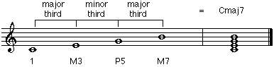
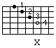

# 7th Chords
by Gunharth Randolf  (13 Jan 03)

- [7th Chords](#7th-chords)
    - [Preface](#preface)
    - [7th Chord Theory](#7th-chord-theory)
    - [Major 7th](#major-7th)
    - [Inversions and Chord Symbols](#inversions-and-chord-symbols)
    - [Voicing Techniques](#voicing-techniques)
        - [Drop 2](#drop-2)
        - [Top 4 Strings](#top-4-strings)
        - [Drop 2 Exercises](#drop-2-exercises)
        - [Middle 4 Strings](#middle-4-strings)
        - [Time Out](#time-out)
        - [Drop 3](#drop-3)
    - [Part 2: Do it Yourself](#part-2-do-it-yourself)
        - [Dominant 7](#dominant-7)
        - [Minor 7](#minor-7)
        - [Chord Progressions](#chord-progressions)
        - [Minor Seven Flat Five](#minor-seven-flat-five)
        - [Diminished Seventh](#diminished-seventh)
    - [7th Chords Overview](#7th-chords-overview)
    - [What's Next](#whats-next)

## Preface

Seventh chords are a continuation of the theory of Intervals and Triads. I therefore strongly recommend that you have good knowledge about these topics. Refer to the articles "Intervals or the Key to Harmonic Understanding" and "Triads - The First Chords" for further information.

Depending on how much you know about 7th chords, the information in this article may not be very earthshaking. Talking about music theory is, on the one hand, a presentation of plain facts that someone has to learn and understand. On the other hand I will point out some practical things that apply both to musical arrangers as well as instrumentalists.

Although the 'hands-on' section of this article targets guitar players I strongly recommend that you try to apply the theory to any other instrument (preferable piano), as the introduced voicing techniques are the basis for any other harmonisation, e.g. a horn section.

The article is divided into two parts. The first part is focussed entirely on the major seventh chord explaining seventh chord theory and voicing techniques.

The second part is meant to be a "do it yourself" section. I encourage you to take the knowledge of the first part and apply it to the second part on your own.

It would be preferable if you have notation paper and a kind of tab paper as working tools. The last page of this article offers a tab template that you can print out and use for drawing the different voicings.

At the end of this article I have a little reward for all your efforts.

Ready, aim, fire ...


## 7th Chord Theory

A 7th chord is constructed by adding another third to a triad. The result is a 4 note voicing stacked up in thirds.

As a first example let's take a C major triad and add another third on top of it. We have two choices. Either we add a major third or a minor third. In both cases we will end up with a seventh chord.


C major triad + major third


The added note is B and is the major seventh of C.


C major triad + minor third


The added note is Bb and is the minor seventh of C.


Todays music distinguishes between five main chord families and seventh chords.

**major seventh**  
**dominant seventh**  
**minor seventh**  
**minor seventh flat five**  
**diminished seventh**

## Major 7th

You can look at a major 7 chord in a few different ways.

\- The formula of a major 7 chord with use of the Interval Chart is 1, M3, P5, M7.


\- To construct a major 7 chord we stack up a major third followed by a minor third followed by a major third starting on the root.



\- A major 7 chord consists of the major triad with added major 7th


\- A major 7 chord incorporates 2 triads (also called Lower Structure Triads).
A major triad starting on the root and a minor triad starting on the third.


All of the above observations will be important at some point. For now we focus on the interval formula for major 7 which is again 1, M3, P5, M7.

The next step is to memorize all 12 major 7 chords and their notes. If you learned all major triads very well you have to think more about adding the major 7th to the existing major triad. As a tip I would first learn all maj7 chords that have no flats or sharps in the name of the root and then change them as needed.
example: Gmaj7 = G, B, D, F# Gbmaj7 = Gb, Bb, Db, F

Here is a table that I encourage you to learn by heart. Also make up your own exercises by rearranging the maj7 chords in different orders. Repeat them over and over again until you feel comfortable in spelling out all maj7 chords.

```text
            1   M3  P5  M7

    Cmaj7   C   E   G   B

    Gmaj7   G   B   D   F#

    Dmaj7   D   F#  A   C#

    Amaj7   A   C#  E   G#

    Emaj7   E   G#  B   D#

    Bmaj7   B   D#  F#  A#

    Gbmaj7  Gb  Bb  Dd  F

    Dbmaj7  Db  F   Ab  C

    Abmaj7  Ab  C   Eb  G

    Ebmaj7  Eb  G   Bb	D

    Bbmaj7  Bb  D   F   A

    Fmaj7   F   A   C   E
```

## Inversions and Chord Symbols

As introduced with triads we can invert a maj7 chord without loosing its sound as a maj7 chord. The only difference is that we have one more inversion to deal with.

Cmaj7 Inversions


Now we run into a problem with the 1st Inversion. If you take a look at the top two voices you will see that their interval relationship is a minor second. There is a very important arranging rule that you should always bear in mind:

**! Never have an interval of a minor second between the top two voices.**


The reason is the dissonance of a minor second. The c should be the melody note on top of the voicing, but because of the minor second interval the c does not stick out anymore or to say it how it is: It sounds like a "mistake".(This "mistake" can sometimes be on purpose, meaning that it is the composer's intention to create a chord with a buzz. It also can be a nice effect when arpeggiating the chord.) Minor seconds between the other voices are fine. And because we are talking about rules here's another one (we will need it later on):

**! Never have an interval of a minor ninth between any of the voices.**


Great. What do we do now? Just never use a maj7 1st Inversion? The solution to this problem is that we change the note b to an a. As a result we change the Cmaj7 chord to a C6 chord.


The official inversions for Cmaj7 are:


Note that the above chords are also called "closed" voicings. There is no "gap" between the individual voices (You will see the difference to "open" voicings in the next chapter).

Let's get this straight:
There is no Cmaj7 chord with the note c in the top voice

Don't trust sheet music. If the chord symbol says Cmaj7 and the melody note is a c the chord symbol is wrong. It should say C6.

Don't play a Cmaj7 chord when e.g. your singer sings the note c. Use a C6 chord.

In terms of chord symbols for major 7 there is a huge variety out there. The one I am using is maj7. Here is a list of symbols that are in use (I'm sure it's not complete).


 : mostly used in Europe. Notice the dash in the 7. The triangle has the disadvantage that if written by hand it could look like a "o" what means diminished.

 : This one could cause some confusion. I saw it in older Show tunes and Musical scores. In this case the European 7 means major 7. But be careful. In Europe this symbol means a C dominant 7 chord (we will talk about this one soon) and not major7.

You see that it can be very helpful to know in what part of the world the sheet music was published.

Inversions of maj7 chords are written in the same way as triads: the actual maj7 chord, then a slash followed by the bass note.


Note: You don't have to worry about inversions when you play with an instrument that plays the root for you. A bass player will lay down the bass note of the inversion and you take care of the actual chord.


## Voicing Techniques

From the above mentioned Cmaj7 chord and its inversions, there is actually only one voicing left that is practically transposable onto the guitar. This voicing is the root position (sometimes referred to as piano voicing). All other inversions require terrible stretches and are not practical.

Here are the two maj7 voicings in root position:

Cmaj7 (root on D string)




Cmaj7 (root on A string)


In order to be able to play all maj7 inversions we have to use an arranging technique that is called Drop 2.


### Drop 2

Drop 2 means that you drop down the second voice (from the top) of a closed voicing by an octave. This sounds more difficult than it actually is.

Example:


If you like you can take all Cmaj7 inversions and apply the Drop 2 technique to analyze the result. I will make a long story short and tell you that this is an important way to generate voicings, not only for guitar but also as a technique for harmonization in general.


### Top 4 Strings

Now we take our Drop 2 voicings that we generated from the four Cmaj7 inversions and transpose them onto the guitar.

Before you start practicing the different voicings I'd like to mention that there are two things I encourage you to memorize.
Memorize the string on which the root is located to enable quick transposing.
Memorize the top note in terms of intervalic relation to the root. This is very important. The top note sticks out as the actual melody note of the chord.


### Drop 2 Exercises

I strongly recommend to do all exercises with a metronome. To play through all 12 keys you can use the "Cycle of Fifth" (C, G, D, A, E, B, Gb, Db, Ab, Eb, Bb, F). But feel free to make up your own combinations.

1) Take one voicing at a time and play it through all 12 keys. This will help to train your ability to locate the root and place the voicing.

2) Start on a voicing and try to stay as close as possible to the original position while going through all 12 keys.

Example:


3) Play all four voicings of a chord up the neck, then change the key and play all four voices down. Go through all 12 keys.

Example:


### Middle 4 Strings

These are the "pictures" for the maj7 Drop 2 voicings on the middle four strings.


You should apply all exercises from the top four strings to the middle four strings.


### Time Out

Well, eight different voicings for one chord (with the piano voicings there are 10). What is this all about and/or how can can we bring some order to this mess?

Each individual voicing has its distinctive sound and timbre because of the intervalic structure and the strings it is played on.

Try to evaluate them in terms of how you like the different sounds. Experiment by playing different voicings in the same musical situation and see whether they work and how they sound and feel.

Get those voicings down! Practice them 'till you are really comfortable with them. They are very important. All future chordal considerations will be in a way related to these voicings and fingerings.


### Drop 3

If you want you can figure out the Drop 2 type fingerings on the bottom 4 strings but for everyday playing they are too low and muddy. They could be used in e.g a chord solo.

Now I want to introduce you to another arranging technique that is called Drop 3.

You can guess that instead of dropping down the second voice of the closed maj7 inversions we drop down the third voice what leads to a bigger span between the voices.

Drop 3 voicings on the guitar are mostly used with the bass note on the low E string and the rest of the voicings on D, g and b string. Although I listed all four voicings I encourage you to focus and learn the one with the root on the E string. Notice that we get two C6 chords because of b2/b9 danger.

Here are the fingerings for Cmaj7 (Drop 3) in order of their importance:


This marks the ending of the first part of this article. As mentioned I encourage you to go through the second part on your own. I will guide you through the remaining seventh chord families by showing you how they are constructed. Your part of the deal is to figure out the guitar voicings.


## Part 2: Do it Yourself

The remaining chord families are dominant 7, minor 7, minor 7 flat five, and diminished 7. Remember that all rules and techniques introduced with the maj7 chord work in the same way.

The good news is that we don't have to think about a minor second or a flat nine interval. All remaining chords do not have these intervals in their structure. As a result all inversions are useful.

I will focus on dominant 7 and minor 7 by showing you the Drop 2 and Drop 3 voicings at the end of this article, although I encourage you to do it on your own. If you need a tab paper for drawing the different fingerings look at the bottom of this page.

If you understand the method of constructing the voicings you will easily be able to construct diminished and minor seventh flat five voicings.

---

### Dominant 7

Construction: 1 M3 P5 b7

In relation to a maj7 chord the dominant 7 has a minor seventh instead of a major seventh.

C7 = C, E, G, Bb

Chord symbol: C7 ( in Europe)

**Drop 2**: You can generate the voicings in two ways:
Write out the different inversions for C7 and then use the Drop 2 technique and transpose them onto the guitar.
Look at the maj7 voicings and change the M7 (where necessary the M6) to a b7.
Pick an approach and figure out the guitar voicings. You can check in the Appendix whether your results are correct.

**Drop 3**: same approaches as with Drop 2

Apply the exercises introduced with maj7 to dominant 7.

---

### Minor 7

Construction: 1 b3 P5 b7

In relation to a dominant 7 chord the minor 7 has a minor third instead of a major third.

Cm7 = C, Eb, G, Bb

Chord symbol: Cm7, C-7, Cmin7, Cmi7

**Drop 2**: You can generate the voicings in two ways:
Write out the different inversions for Cm7 and then use the Drop 2 technique and transpose them onto the guitar.
Look at the dominant7 voicings and change the M3 to a b3.
Pick an approach and figure out the guitar voicings. You can check in the Appendix whether your results are correct.

**Drop 3**: same approaches as with Drop 2

Apply the exercises introduced with maj7 to minor 7.

---

### Chord Progressions

At this point it would be a good idea to apply the already learned voicings to actual chord progressions. Use progressions that incorporate maj7, 7 and m7 chords.

Try to move as smooth as possible from one chord to the next one (Remember voice leading?)
Try to use more than one voicing for each chord.
Make sure to practice the chord progressions in different keys.

Examples:
I Cmaj7 I G7 I
I Dm7 I A7 I
I Cmaj7 I Am7 I Dm7 I G7 I

In order to complete the list of all chord families I will show you the construction of minor seven flat five and diminished seventh chords.

---

### Minor Seven Flat Five

Construction: 1 b3 b5 b7

In relation to a minor 7 chord the minor 7 flat five has a diminished fifth instead of a perfect fifth. Sometimes this chord is also called half diminished.

Cm7b5 = C, Eb, Gb, Bb

Chord symbol: Cm7b5, Cø7

**Drop 2**: The voicings can be generated in two ways:
- Write out the different inversions for Cm7b5 and then use the Drop 2 technique and transpose them onto the guitar.
- Look at the minor7 voicings and change the P5 to a b5.

**Drop 3**: same approaches as with Drop 2

Apply the exercises introduced with maj7 to m7b5.

---

### Diminished Seventh

Construction: 1 b3 b5 o7

In relation to a minor 7 b5 chord the diminished 7 has a diminished seventh instead of a minor seventh. Notice that the diminished chord is build up entirely of minor thirds,e.g. all voicings on the same pairs of strings have the same fingerings.

Co7 = C, Eb, Gb, Bbb (=A)

Chord symbol: Co7, Cdim7

**Drop 2**: The voicings can be generated in two ways:
- Write out the different inversions for Co7 and then use the Drop 2 technique and transpose them onto the guitar.
- Look at the minor7b5 voicings and change the b7 to a o7.

**Drop 3**: same approaches as with Drop 2

Apply the exercises introduced with maj7 to o7.


## 7th Chords Overview

Finally this table shows you the construction of all 7th chords in relation to each other and an example for each chord starting on the root G.

```text
    maj7    1 M3 P5 M7      Gmaj7       G  B  D  F#


    7       1 M3 P5 b7      G7          G  B  D  F


    m7      1 b3 P5 b7      Gm7         G  Bb D  F


    m7b5    1 b3 b5 b7      Gm7b5       G  Bb Db F


    o7      1 b3 b5 o7      Go7         G  Bb Db Fb (=E)
```

## What's Next

You may have realized that the fingerings for the C6 chords are exactly identical with Cm7 fingerings except that they are played in a different position. If you take Am7 voicings instead you will notice that they are exactly the same. This means that a C6 and a Am7 chord consist of the same notes. With this knowledge we are entering the topic of using substitute chords to create tensions over the original chord.

But this is another story ....

PDF files
[Dom7 and m7 voicings](pdf/appendix.pdf)

[Tab Paper](pdf/tab_paper.pdf)

[A little reward](pdf/a_little_reward.pdf)
