# Chord Scales - Part 1: The Major Scale
by Gunharth Randolf  (07 Apr 03) 

- [Chord Scales - Part 1: The Major Scale](#chord-scales---part-1-the-major-scale)
    - [Introduction](#introduction)
    - [Major Scales Formula](#major-scales-formula)
    - [Rules For Constructing Major Scales](#rules-for-constructing-major-scales)
    - [Tetrachords](#tetrachords)
    - [Sharps and Flats](#sharps-and-flats)
        - [Major Scales that take Sharps](#major-scales-that-take-sharps)
        - [Major Scales that take Flats](#major-scales-that-take-flats)
    - [Major Scales Overview: Cycle of Fifths](#major-scales-overview-cycle-of-fifths)
    - [First Exercises](#first-exercises)
    - [Quick Review](#quick-review)
    - [Intervals within a Major Scale](#intervals-within-a-major-scale)
    - [Chords Derived From Major Scales](#chords-derived-from-major-scales)
    - [Major Formulas Overview](#major-formulas-overview)
    - [Applications of Chord Scale Knowledge](#applications-of-chord-scale-knowledge)
        - [Analyzing](#analyzing)
        - [Transposing](#transposing)
        - [Improvisation](#improvisation)
    - [Second Exercises](#second-exercises)
    - [A Couple Words On Natural Minor](#a-couple-words-on-natural-minor)
    - [Final Words](#final-words)
    - [Solutions of Exercises](#solutions-of-exercises)

    
## Introduction

Welcome to this first part about chord scales.

I decided to deal with this topic in three separate articles. It has been my experience that music students know much more about modes than the actual major scales. In my view, this is an ignorance that leads to misunderstandings regarding modes and their application.

To make this clear: Understanding major scales is a prerequisite for understanding modes and chord scales. I therefore dedicate this entire first part to the theory of major scales. Note that the terms "modes" and "chord scales" are used to actually describe the same thing, that is chords, their function, and the notes they take.

For some of you this article may not include earthshaking discoveries. Nevertheless, I encourage you to read through it, compare the presented content with your own knowledge and see it as a review.

It would be very helpful to have knowledge about intervals, triads, and 7th chords.

If you have any questions, comments, suggestions or criticism please feel free to post them in the forum here at iBreatheMusic.

And off we go ...


## Major Scales Formula

Let's jump right into our topic by examining the construction and formula of major scales. 

The C major scale is a handy tool for demonstration because it contains no accidentals, i.e., only natural note names. 

To demonstrate the scale's structure I use the symbols 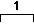 for a whole step (two frets) and  for a half step (one fret).

Let's have a look at the C major scale and the structure of whole and half steps:

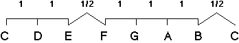

If we forget the fact that we are using C as our Root and just take a look at the structure we get a plain formula that we can apply to all major scales - we just have to choose a root and fill in the right note names.

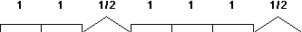

"Why is that?" you may ask. At this point and I think it's a reasonable question - I am tempted to answer with "That's a fact... That's how it is.... It's like Mathematics using place holders (x=y+1)..... You just have to know this......". 

I guess there's no satisfying answer. Seriously, we would have to take a trip through centuries of Western music history to understand the evolving of today's harmonic understanding. The most important step for its development was that Andreas Werckmeister introduced the "Well-Tempered tuning" in 1691 - meaning the division of one octave into 12 equal half steps (known as chromatic scale). 

This tuning allows us to transpose a composition without loosing it's character, which was demonstrated by Johann Sebastian Bach who wrote a Prelude and Fugue in every key, known as "The Well Tempered Clavier". 

(In my hometown Innsbruck, Austria there is a church that has a pipe organ which was built long before 1691, meaning no well- tempered tuning. I once had a chance to listen to it and believe me when I tell you that it really hurt - for our ears it's totally out of tune - no band in the world can play that scary - Man, what a way to praise the Lord?!?).

One more thing: I encountered different opinions regarding the question "How many different notes are in a major scale?". The answer is 7 and not 8.

Although the second C is most of the time pictured to demonstrate the half step from B to C it actually doubles the Root C and is not considered a new scale tone.

## Rules For Constructing Major Scales

Rule #1: Never mix sharps and flats within one scale.
Rule #2: Every natural note name has to be used once and is not allowed to be used twice. Natural note names are c, d, e, f, g, a, and b. All scales contain these note names either in original form or with their appropriate alteration, meaning added sharp or flat.

Now that we have set up the rules we can actually start creating major scales.

Example: Construction of the D major scale 

What we know up to now is that D is the Root. Using the major scale formula we fill in the missing note names. In parenthesis I included the "way of thinking".

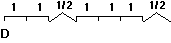


(D is the Root - next note is a whole step above D - that's E)

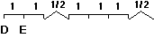


(Another whole step - this time from E - we know that between E and F is a half step - therefore it can't be F - we have to alter F by using a # to make it a whole step. You may say "why can't I call it a Gb - it's the same pitch?". If you do this you infringe Rule #2 by skipping the note name F)

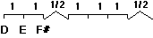


(Next note is a half step above F# - well, G)

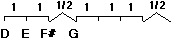


(Now we have to name 3 whole steps in a row - G plus a whole step is A - A plus a whole step is B - B to C is a half step; to make it a whole step we have to name it C#)

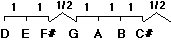


(We already named all seven different note names of the D major scale. In order to complete the circle we include the half step from C# that brings us back to the Root D)

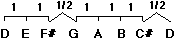


Let's check our result with the rules mentioned above. There are only sharps in the scale - all natural note names are used once, with 2 alterations of F and C to fit the formula. 


## Tetrachords

Another way to look at the construction of the major scale is by dividing it into two equal pieces called Tetrachords (tetra is Greek for four, ie four note chord), which are connected by a whole step.

Again in C:

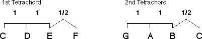

Connected by a whole step we get the same result as where we started out.

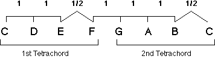

I mention these tetrachords because they are very helpful when writing out all possible major scales in an logical (and musical) order, which we are going to do on the next page.


## Sharps and Flats

### Major Scales that take Sharps

We already know the C major scale and their note names. What we do now is to take the 2nd tetrachord of the C major scale and make it the 1st tetrachord of a new scale. 

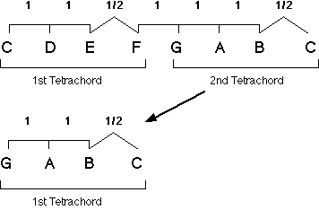


That means that G is our new root. Due to the fact that 1st and 2nd tetrachord are identical in their structure the four notes g, a, b, and c are the first four notes of the G major scale. We just have to form the 2nd tetrachord, which is d, e, f#, g. 

G major scale:

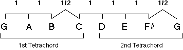

Now we repeat the whole procedure: take the 2nd tetrachord of G and make it the 1st of D. Then form the 2nd tetrachord of D, which is a, b, c#, d. We get the same note names as on the last page.
D major scale:

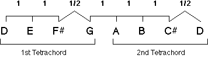

You can continue to do this the same way - next major scale would be A. Notice that everytime you do this, it adds one more sharp to the new scale. To shorten this whole thing I list all possible major scales that use sharps below. Furthermore I list the numbers of sharps that are included and their note names: 
(F# and C# major scales are in parenthesis because they are not very practicable. I listed them to show the complete list.)

List of all major scales that take sharps

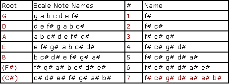

More important than the spelling of the different scales is that you learn, by heart, the numbers of sharps a specific scale contains and the series of "sharpened" notes (f# c# g# d# a# e# b#). That's why I labeled the important spots red.

Example of how you should memorize the table above:

G major scale - 1 sharp - sharpened note is f#
D major scale - 2 sharps- - sharpened notes are f# c#
.........
B major scale - 5 sharps - sharpened notes are f# c# g# d# a#

Example for writing out E major scale:
1) Write down the natural note names starting from the root: e f g a b c d 
2) You know that E major scale takes four sharps and you learn the series of "sharpened" notes. Take the first four of this series(f# c# g# d#), and insert it into the scale: e f# g# a b c# d#.

This thinking is a fast way of constructing a scale and applicable to a lot of different musical skills, like sight reading.


### Major Scales that take Flats

Constructing major scales that take flats is the same procedure. The only difference is that we take the 1st tetrachord and make it the 2nd tetrachord of the new scale.

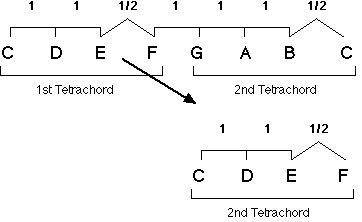

The Root of the new scale is determined by the last note of this tetrachord - in our example F. Now we have to construct the missing 1st tetrachord, which is f, g, a, bb.
F major scale:

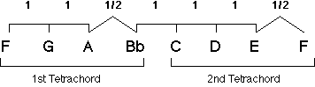

We repeat the procedure and construct Bb major scale:

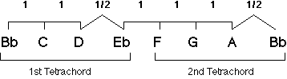

You can continue to write out major scales like this until you reach Cb major.


List of all major scales that take flats

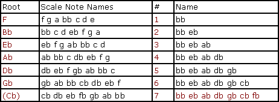

Again, important is the number of flats a scale takes and the series of "flattened" notes.

Learning the series of added flats and sharps is also a big help when figuring out which scale has what number of sharps or flats. Let's say you would like to know the scale that has 3 sharps. The first 3 sharpened notes out of our series are f# c# g#. The last sharpened note (in our case g#) is always a half step below the root of the actual scale (in our case A). You can apply this thinking to all scales that take sharps.

Scales that take flats can be identified by looking at the second last note in the series of flattened notes. Let's take a look at the first three flattened notes which are bb eb ab. The second last note is eb and this is also the major scale. 


## Major Scales Overview: Cycle of Fifths

The Cycle of Fifths offers the best visual overview of all 12 major scales and their accidentals. All scales that use sharps are listed on the right side - scales using flats are on the left side. 

Note that I did not list the unpractical scales C#, Cb, and F#. They are represented by their enharmonic equivalent of Db, B, and Gb. 

If you follow the different roots clockwise you'll notice that they are the interval of a perfect fifth apart. (c to g = fifth) - that's where the Cycle of Fifths got it's name from. Furthermore, we see that the series of major scales is the same as we already created using our tetrachords.

It might be helpful to compare the Cycle of Fifths with a clock when trying to memorize it - like "Noon" is C major (no accidentals), or "3 o'clock" is A major (3 sharps) etc....

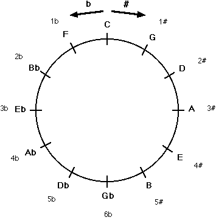


## First Exercises

Before you go through the exercises, I recommend that you first spend some time learning the different major scales. Print and fill out this section (The solutions are at the end of this article). 

Make up your own exercises. Would be cool if you post these in the forums for all of us.

1) How many accidentals does each major scale take , and what are their names?

Example: Eb = 3 flats = bb eb ab

G =

Bb =

B =

Ab =

Gb =

E =

D =

F =


2) Write out the requested major scales

Example: G = g a b c d e f# 

B = 

A = 

Eb = 

Db = 

F = 

D = 


3) Draw the Cycle of Fifths

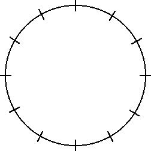


## Quick Review

Let's take a quick look at what we have learned so far:

The formula for a major scale is 

We set up rules to fill out the formula above:
- only sharps or only flats within a scale
- all natural note names have to be used once - and only once; where necessary we have to add accidentals.

We created all possible major scales that use sharps and flats by using tetrachords.

We learned the series of "sharpened" and "flattened" notes and memorized how many sharps or flats a scale takes.

To help us memorize all major scales we learned the Cycle of Fifths.


## Intervals within a Major Scale

Although I dedicated an entire article to intervals ("Intervals - The Key to Harmonic Understanding") I'd like to include a quick look at the intervals of a major scale. Examining a scale by its intervalic structure is incredibly important for our goal of understanding chord scales.

Well, again in C:

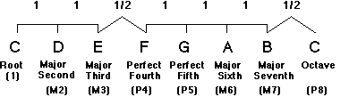


Instead of thinking of a major scale in terms of whole and half steps, we now have the possibility of describing it with intervals.

Any major scale is made up of these intervals:

**1 M2 M3 P4 P5 M6 M7**

(Please refer to the Interval article mentioned above if you are not sure whether you understand this topic.)


Harmonized Major Scale

Now that we have dealt with major scales in horizontal direction, lets start to take a look at their vertical structure, meaning their scale internal chords.

Plain C major scale:

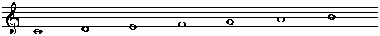

We start out by harmonizing the major scale with thirds that are diatonic to the scale (diatonic means part of the scale). Below I included the resulting interval starting from each scale note:

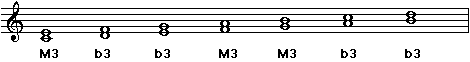

If we add another third on top we get all triads within C major:

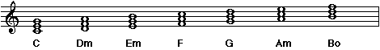

By adding another third on top we get all 7th chords within C major:

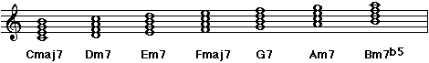

I cannot emphasize how important the above really is. Here lies the answer to questions like "How can I transpose this tune?" or "How can I improvise over this chord progression?".


## Chords Derived From Major Scales

We already learned all major scales, their structure and accidentals. In the same way we created a formula for the horizontal direction of scales, we can also create one for the vertical direction, meaning chords.

I will focus on the 7th chords because triads and intervals are part of it and easy to derive. Instead of Arabic numbers, chords are presented by Roman numerals.

Here are the 7th chords from C major with their appropriate numeric values:

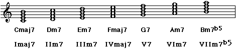

Again, forget about the fact that we used C major for demonstration and take a look at the formula for the individual chords:

**Imaj7 IIm7 IIIm7 IVmaj7 V7 VIm7 VIIm7b5**


This formula is identical whatever scale and key you are in. If you write out all 7th chords within D major you end up with the same result regarding Roman numerals and chord quality. Here's the proof:

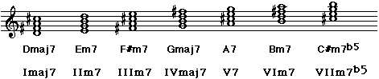

This means that if you know the single notes of a major scale you also know which chords the scale contains.


## Major Formulas Overview

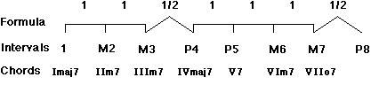

Another very helpful way of looking at the chords is to memorize them by chord quality:

**I and IV are maj7 chords  
II, III, and VI are m7 chords  
V is a 7 chord  
VII is a m7b5 chord**


## Applications of Chord Scale Knowledge

### Analyzing

Now that we know the there is a strict system to the chords qualities of a scale I want to give a brief example of analyzing a chord progression.

Let's say we have
```text
    |    Cmaj7    |    Am7    |    Fmaj7    |    G7    |
```
We have to answer these two questions, "What key is it in?" and "What are the Roman Numerals of the chords?".

Below I go through the whole process of analyzing of the above progression (I promise to do it just once!). Let's take every individual chord and analyze it in terms of its function:

Cmaj7: We know that maj7 chords can be Imaj7 or IVmaj7. Imaj7 would be key of C - IVmaj7 key of G.

Am7: There are three possibilities: IIm7 in G, IIIm7 in F, and VIm7 in C.

Fmaj7: Like Cmaj7 two possibilities: Imaj7 in F, IVmaj7 in C.

G7: Dominant seventh chords have only one possibility - V7 of C


Let's take a look at all possibilities:
```text
        |    Cmaj7    |    Am7    |    Fmaj7    |    G7    |

          Imaj7 in C    IIm7 in G    Imaj7 in F    V7 in C

          IVmaj7 in G   IIIm7 in F   IVmaj7 in C 

                         VIm7 in C
```
Now that we wrote out all possibilities we can bring it down to one answer: all chords are part of C. Therefore, our analyzed progression looks like this:
```text
        |    Cmaj7    |    Am7    |    Fmaj7    |    G7    |

             Imaj7         VIm7        IVmaj7        V7
```


### Transposing

One advantage of being able to analyze a chord progression is that it enables us to easily transpose it into a new key (provided that you know your scales and intervals!).

Let's take the same chord progression from above: | Cmaj7 | Am7 | Fmaj7 | G7 |. You want to play these chords in C but your singer insists on playing it in G (singers never do what they are expected to - kind of a occupational disease). 

Anyway, you go with the singer, think of the progression's formula | Imaj7 | VIm7 | IVmaj7 | V7 |, and fill in the right note names for G major.

Here's a way of thinking to get to the correct result:

chords: 
```text
       |    Imaj7    |    VIm7    |    IVmaj7    |    V7    |
```

covert these to numbers for the note names:
```text
       |    1        |    6       |    4         |    5     |
```

note names:
```text
       |    g        |    e       |    c         |    d     |
```

apply chords to note names:
```text
       | Gmaj7       |    Em7     |    Cmaj7     |    D7    |
```

### Improvisation

A next logical step is that after analyzing a chord progression you know which key and scale the chords are in. Therefore, you can use this same major scale for improvisation.

Our example:
```text
    |    Cmaj7    |    Am7    |    Fmaj7    |    G7   |
```
Improvise with the C major scale over all chords.

or
```text
    |   Gmaj7     |    Em7    |    Cmaj7     |    D7    |
```
Improvise with the G major scale over all chords.


## Second Exercises

1. Write out all 7th chords that are derived from B major.


2. Analyze the chord progressions below. List all possibilities for each chord (like Cmaj7 can be I of C and IV of G).
```text
       | Amaj7       |    F#m7     |    B7     |    Emaj7    |
```

3) Write out this chord progression
```text
       |  IIIm7   |   VIm7   |   IIm7   |  V7  VIIm7b5 |  Imaj7  | 

in G   |          |          |          |              |         | 

in Bb  |          |          |          |              |         |

in Eb  |          |          |          |              |         |
```

4) Transpose this progression into the key of Ab.
```text
         |   D   |   A   |   Bm   |   G   |

in Ab    |       |       |        |       |
```

## A Couple Words On Natural Minor

After all these explanations concerning major scales you will think that you have to learn the same amount of information for minor too, because it is widely known that music theory distinguishes major and minor keys.

Not exactly! I can assure you that you already did most of the work. We just have to change our view of the major scale by starting on a different root.

The sixth scale degree of a major scale is the root of its relative (natural) minor scale.

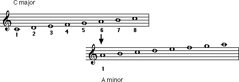


The sixth scale degree of C is A, which is the root of the A natural minor scale. As a result we can say that C major and A minor consist of the same notes (no accidentals). 

Furthermore, we can state that they include the same chords.

The only difference is that scale formula, intervals, and chord numberings change according to the new Root.

Natural Minor Overview

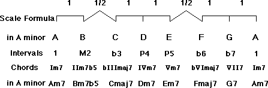


Finally, I want to show all major scales with their relative minor scales using the Cycle of Fifths. 

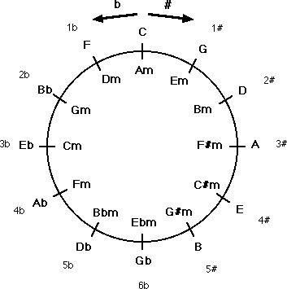


## Final Words

I hope that you have enjoyed this article and that it showed you a practical way to approach and understand major scales. I am available in the forums for any further queries you might have.

See you in there,

Guni


## Solutions of Exercises


First Exercises

1) How many accidentals does each major scale take , and what are their names?

Example: Eb - 3 flats - bb eb ab

G = 1 sharp = f# 
Bb= 2 flats = bb eb
B = 5 sharps = f# c# g# d# a# 
Ab = 4 flats = bb eb as db
Gb = 6 flats = bb eb ab db gb cb 
E = 4 sharps = f# c# g# d#
D = 2 sharps = f# c# F 1 flat bb 


2) Write out the requested major scales

Example: G = g a b c d e f# 

B = b c# d# e f# g# a# 
A = a b c# d e f# g# 
Eb = eb f g ab bb c d 
Db= db eb f gb ab bb c 
F = f g a bb c d e 
D = d e f# g a b c# 


3) Draw the Cycle of Fifths

Compare your result with the one in this article.


Second Exercoises

1) Write out all 7th chords that are derived from B major.

Bmaj7 C#m7 D#m7 Emaj7 F#7 G#m7 A#m7b5


2) Analyze the chord progressions below. List all possibilities for each chord (like Cmaj7 can be I of C and IV of G). 
```text
    | Amaj7       |    F#m7     |    B7     |    Emaj7    |
      I in A         II in E       V in E       I in E
     IV in E        III in D                    IV in B 
                     VI in A
```
3) Write out this chord progression
```text
       |  IIIm7   |   VIm7   |   IIm7   |  V7  VIIm7b5 |  Imaj7  | 

in G   |   Bm7    |   Em7    |   Am7    |  D7  F#m7b5  |  Gmaj7  |

in Bb  |   Dm7    |   Gm7    |   Cm7    |  F7  Am7b5   |  Bbmaj7 |

in Eb  |   Gm7    |   Cm7    |   Fm7    |  Bb7 Dm7b5   |  Ebmaj7 |
```

4) Transpose this progression into the key of Ab.
```text
         |   D   |   A   |   Bm   |   G   |

in Ab    |   Ab  |   Eb  |   Fm   |   Db  |
'''