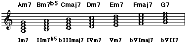
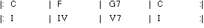

# Chord Scales - Part 3: More Scales
by Gunharth Randolf  (12 Apr 03) 

- [Chord Scales - Part 3: More Scales](#chord-scales---part-3-more-scales)
    - [Introduction](#introduction)
    - [Review: Natural Minor - Aeolian Mode](#review-natural-minor---aeolian-mode)
    - [Natural Minor Modes](#natural-minor-modes)
        - [First Time Out](#first-time-out)
        - [First Exercises](#first-exercises)
    - [Harmonic Minor](#harmonic-minor)
        - [A brief note on Dominant 7 chords](#a-brief-note-on-dominant-7-chords)
        - [Chords within Harmonic Minor](#chords-within-harmonic-minor)
        - [Modes Within Harmonic Minor](#modes-within-harmonic-minor)
        - [Second Time Out](#second-time-out)
        - [The Attempt to an Harmonic Minor Overview](#the-attempt-to-an-harmonic-minor-overview)
        - [Second Exercises](#second-exercises)
    - [Melodic Minor](#melodic-minor)
        - [A Melodic Minor](#a-melodic-minor)
        - [Chords Within Melodic Minor](#chords-within-melodic-minor)
        - [Scales Within Melodic Minor](#scales-within-melodic-minor)
        - [From Superlocrian to Altered](#from-superlocrian-to-altered)
        - [Melodic Minor Overview](#melodic-minor-overview)
    - [Symmetric Scales](#symmetric-scales)
        - [Whole Tone Scale](#whole-tone-scale)
        - [Chromatic Scale](#chromatic-scale)
        - [Whole Half Tone Scale](#whole-half-tone-scale)
        - [Half Whole Tone Scale](#half-whole-tone-scale)
    - [And Finally ...](#and-finally)
    - [Final Words](#final-words)
    - [Solutions for Exercises](#solutions-for-exercises)

## Introduction

Welcome to this third theory part about chord scales and modes.

Wow, I'm impressed that you are still with me on our journey through chords and modes. I assume that you have read and worked through part 1 and 2 of this article (if not I strongly recommend you have a look at them!). 

As promised this article deals with the chord scale theory of Harmonic and Melodic Minor. I've also added a section that briefly discusses symmetric scales.

**Warning**: there's a lot of theory in this article. You do not have to work through this article right away if you are not up to it - see it as an appendix to Part 1 and Part 2, which includes the most important fundamentals by far. Use this article as a reference to look up certain topics or scales. Applying the information contained in this article onto your instrument takes years of practice and research. Take your time with it ...

I hope you'll find this article helpful and informative.


## Review: Natural Minor - Aeolian Mode

Before we talk about Harmonic and Melodic Minor, I'd like to review Natural Minor also referred to as Relative Minor or Aeolian Mode. Don't get confused with all these different terms for Natural Minor - they actually mean the same thing.

It's important to set Harmonic and Melodic Minor in relation to Natural Minor. 

You can think about it in this way: first there was Natural Minor, which then was altered to Harmonic and Melodic Minor to create a stronger harmonic context (more on this later).

Natural Minor is equal to a scale starting on the sixth degree of a major scale. In the key of C this is A minor.


A Natural Minor


Straight forward, isn't it? 

So, what if we build up chords on each individual note of the scale? Or what happens if we write out scales from each individual scale note? 

Yes, we already did that. The scales and chords are identical to the ones we talked about in Chord Scales Part 2, when we wrote out the modes and chords for C major. 

The only difference is that we start on the 6th of the major scale and not on the root. Due to the fact that the notes of C major and A minor are identical, the modes and chords have to be identical, with the exception of their order of appearance.


## Natural Minor Modes

Below are all the modes and scales that are derived from A Natural Minor. As a reminder I included the tensions of the chords (in parenthesis) and their avoid notes.


Here's another look at the chords and their Roman Numerals within A Natural Minor: (notice that the Roman Numerals include a flat to indicate a minor interval)




### First Time Out

Theory and knowledge is great. It can help you to understand the 'why and how' and make your life as a musician much easier. Nevertheless, I'd like to take the opportunity now (before it's too late and you close or burn this article) to show you a practical usage. 

Let's take the above theory and try to apply it to the "real world (?)". Let's say you want to write a popy-rockish tune in Am (why should we deal with accidentals?). 

If you have tried to play the chords above, you will have experienced that they do not sound very "popular-music-like". They are nice sounding for Soul and Jazz, but they do not satisfy the sound and feel of straight ahead Pop songs (whatever this means).

Firstly, throw away the 7th of every chord, so that you are left with plain Triads:

Am Bdim C Dm Em F G
Bdim? Throw it away! 
Am C Dm Em F G


What's left are 6 minor/major Triads that we can use to create progressions that relate to the key of Am. Here are a few examples: play them and make up your own progressions.


I hope you enjoyed this little trip. Let's get back to our theory though. If you feel comfortable with the Natural Minor scale you can skip the exercises below (did I write this?) and go straight to the next page. If you do not feel comfortable with the above, please try the exercises below and if necessary review the first two articles about Chord Scales.


### First Exercises

1) Write out the Natural Minor scale starting on the notes below.

e:
g:
bb:
c#:


2) Write out the chords for the following chord progression:
```text
          Im7      bIIImaj7      Vm7       IVm7

in Em: 

in Cm:
```

3) Write out all notes, Roman Numerals, chords, scales, tensions and avoid notes for D Natural Minor.
```text
Note      Roman Numeral   Chord    Scale     Tensions      Avoid Notes

d

.

.

.

.

.

.
```


## Harmonic Minor

Before I explain the importance of Harmonic Minor in todays music, I'd like to give you a quick introduction on how it evolved. Again, we have to take a look at Classical music and one of its most important chord progressions: the cadence (see also this page of the article "Triads - The First Chords").


Major Cadence

A basic major cadence consists of the I, IV, and V chord of a key. To create a stronger "tension-release" effect the 7th was added to the V chord.
Play this C major cadence:



Now let's get back to minor: If we create the I - IV - V - I cadence in minor, we get this for A minor:


If you play through the cadence, you will probably agree with me that there's not a lot of tension in it. In fact it sounds a little bit "flat" compared to the major cadence. To pep up the minor cadence the Vm chord was altered to a Dominant7 chord. 


Next to adding the minor seventh (d) to the Em chord, which is diatonic to the key the minor third was changed to a major third (g#).


### A brief note on Dominant 7 chords

A Dom7 chord is made up of the intervals Root (1), Major 3rd (M3), Perfect Fifth (P5), and Minor 7th (b7). M3 and b7 form together the interval of a diminished 5th (b5). 


You may remember that the b5 is also called the Tritone and that it has a strong dissonance level that creates tension. This Tritone is responsible for the "instable" sound of a Dom7 chord. 

If we delve a little deeper: If you just play the M3 and b7 of the Dominant chord you still hear the tendency for resolution. That's why the M3 and the b7 are called the "Guide Tones" - they guide you to a new and stable sound.

In depth: M3 has the tendency to resolve up into the Root of the stable chord, b7 has the tendency to resolve down into the Third of the stable chord.

in major in minor


Back to our Harmonic Minor. OK, we have changed the V chord to make it a Dominant7 to get a stronger cadence. Furthermore, this means that we changed the underlying scale, i.e., Natural Minor, by replacing the note g with a g#.

Let's take a look at it:

A Harmonic Minor


The interesting thing is that we get the Interval of a minor third between the sixth and the seventh scale degree which gives it this "Classical and Spanish" sound.

Here are the fingerings in fifth position for A Natural and Harmonic Minor: play and listen to it.


Now record the minor cadence, i.e., Am - Dm - E7 - Am and improvise with the A Harmonic Minor scale. Listen closely to what is happening during E7. You can also play Natural Minor over Am and Dm and just use A Harmonic Minor over the E7. This is a more common way to approach these chords.


### Chords within Harmonic Minor

Now that we have learned the structure of Harmonic Minor, we can follow the same procedure as with the major scale. We examine Harmonic Minor starting on each individual note of the scale and analyze the resulting scale and chords.

Remember the two different approaches that I used to explain the modes and chords of the major scale, and that we finally figured out that scales are chords and vice versa. The same fundamental rule applies here. 

Let's start out with the basic 7th chords that are included in A Harmonic Minor:


In comparison to Natural Minor we get four differences: Ammaj7 on I, Cmaj7#5 on bIII, E7 on V, and G#o7 on VII.

Just incase you are new to some of the above chords, I included fingerings for Ammaj7, Cmaj7#5, and G#o7.


### Modes Within Harmonic Minor

Just as we did with chords, we now examine and analyze the scales starting on every note of Harmonic Minor. Note that all scales are set in relation to the modes we have already learned within the Major Scale (Ionian, Dorian, etc...). These names are just slightly adjusted to fit their harmonic purpose in Harmonic Minor.

Another abbreviation I included below is HM followed by a number, e.g., HM1, HM2, HM3, etc.... This stands for Harmonic Minor starting on the first, second, third, etc... note of the scale. To make it clearer, I included all 7th chords and their tensions.


1, b3, b5, b7 spell out a m7b5 chord. Therefore, the scale has to be some kind of Locrian. Now let's take a look at the tensions. The Locrian we have learned in context with a major scale has the tension b9, 11, and b13. The scale above has a M13 instead of a b13. This difference is incorporated in the name of the scale.


I think you see how this works. The scale above is closest related to a major scale, i.e., Ionian with an augmented fifth. 


This scale is also referred to as Harmonic Dominant, Phrygian Major and HM5 (I am sure these are not all of them ), with Mixolydian b9 b13 being the most precise description to satisfy the dominant function of the chord.


Diminished has it's own story altogether. I will have to talk about it some other time to explain it in full. There are different approaches depending on the harmonic function of the chord. Don't worry too much about this now - just memorize the fact that this is our first scale that can be used over a diminished chord.


### Second Time Out

Now that you have an overview of what Harmonic Minor is about, I'd like to spend a little time putting this whole thing into a useful perspective. 

Not all of the Harmonic Minor chords and modes are useful in a musician's daily life.

When I started out I was very interested in music theory. I wanted to know and understand all the terms, scales, chords, etc... that I found in books and magazines. 

As a result I own about 15 harmony books covering Classic to Jazz (You call that crazy?). Each of these books showed me music theory in a slightly different way, according to the authors perspective. 

And believe me when I tell you that it took some time until I developed my own view of this material. The thing is that when you learn about a topic for the first time everything seems to be equally important. Then time and practice shows the "real face" of the material.

Below I will try to demonstrate which of the Harmonic Minor modes are important in relation to the chords - don't get me wrong, you should know all of them, but from a playing, composing, arranging point of view we can set some preferences. 

Another thing, please do not learn the modes by memorizing HM1, HM2,etc... This doesn't help you at all - important are the chords and the modes that express what intervals, and therefore notes, are within a scale. 

### The Attempt to an Harmonic Minor Overview


### Second Exercises

1) Write out the Harmonic Minor scale from the notes below.

d:  
g:  
f:  
e:  

2) List all chords and scales for C Harmonic Minor. Include the chord symbol, tensions, and the scale.


## Melodic Minor

As you can imagine, the procedure for Melodic Minor is no different than with all other chords and scales. Therefore, I will try to make it as painless as possible by listing the chords and scales and by pointing out some important and practical points.

Melodic Minor is a further development of Harmonic Minor. To straighten out the "unfamiliar" sound (to Western Music) of a minor third between the 6th and 7th scale degree in Harmonic Minor, the minor sixth was raised by a half step to a major sixth.

Let's have a look:

### A Melodic Minor


You may realize that step by step we get closer to the actual A major scale. The only difference left between A Melodic Minor and A Major is the third - all other intervals are identical (Sometimes it can be helpful to think of melodic minor as a major scale with a minor third).

A Melodic Minor in 5th position


Compare this fingering with natural and harmonic minor.


### Chords Within Melodic Minor


The interesting thing is the last four chords we get: two dominant7 chords on IV and V and two m7b5 chords on VI and VII. VIIm7b5 is a special case and we will talk about it soon.


### Scales Within Melodic Minor

Let's again compare each scale with the ones we already know and see what we come up with. I included the chords, their tensions, together with the abbreviation MM for a better orientation.


(you could think of it as a major scale with a minor third or dorian with a major 7th)


Now, sometimes this scale is also named Lydian b7. Although technically this is a right description, I think that this name points into the wrong direction. When I hear Lydian I immediately think of a major7 chord (I strongly hope that you do too). Due to the fact that the chord for this scale is D7, I like to see (hear) the function of the chord, meaning Mixolydian with tensions #11.


Everything fine with you? How about the G#7? We did not get this chord when we listed the 7th chords of melodic minor. Here we have a special case that I will explain below (I just included it right away to make sure you do not fall asleep!).


### From Superlocrian to Altered

If we stick to the rules and examine the scale starting on the 7th of melodic minor, we get a Locrian scale with tensions b9, b11, and b13. This scale is referred to as Superlocrian, probably because of tension b11, which makes it "more locrian" than regular locrian with tension 11.


I already mentioned that whenever you approach a m7b5 chord it is best to go with straight locrian. Therefore, there is no need for another locrian scale that we would not use anyway. The diminished fourth (c) gives us the opportunity to do a conversion of the scale above by seeing it as a major third (b#). As a result the scale changes from a locrian to a dominant sound. Using enharmonic spelling we change the b3 to a #2 and the b5 to a #4.

Take a look: same scale, different meaning


The result is that we get a dominant scale with tensions b9, #9, #11, and b13, which by the way, are all possible tensions for a dominant chord. 

Notice that the dominant chord is not complete - it misses the perfect fifth, which is no big deal, because we know that the important two chord tones are major third and minor 7th (don't we?). If there is no perfect fifth in the chord we could further rearrange the above scale by saying that #11 is b5 and b13 is #5: G#7(b9 #9 b5 #5)

Before you stumble into total confusion, I'd like to summarize the facts about altered that you should memorize for now:
- Altered is created on the 7th degree of melodic minor.
- It is a dominant scale with tensions b9, #9, #11 (b5), b13 (#5) without a perfect fifth.
- common chord symbols for altered are 7alt, 7#9b13, or any other combination of the available tensions.

### Melodic Minor Overview


Now, take Natural, Harmonic, and Melodic Minor, compare them and memorize the differences. Make a list of all scales, chords, and tensions.

You can ask yourself questions like:

What are the common chords in Natural and Harmonic Minor? - or what are the common chords in Harmonic and Melodic Minor?

How many different chords are there all together in these minor keys and on which scale degree are they originated from?


## Symmetric Scales

With this last section about the theory of chords and their scales, I'd like to give you a quick overview of symmetrical scales.

Symmetric scales divide one octave into equally pieces (intervals) or follow a specific intervalic pattern.


### Whole Tone Scale

As the name states, the whole tone scale consists entirely of whole tone steps, ie major seconds.

Let's build up this scale starting on the note C:

C D E F# G# Bb C


An interesting fact is that this scale contains 6 different notes (the octave not included) - up to now all scales we have talked about contain seven notes. 

Let's take a closer look at the individual intervals that can give us an idea of its use:


By examining the chord tones we see that this scale fits over a Dom7 chord, indicated by 1, M3, and b7. As with the altered scale there is no perfect fifth in the whole tone scale - we get a #5 instead. 

This scale is mostly used over a Dom7#5.

To be more accurate I show the chord for the scale above with its possible tensions: C7#5 (9 #11)

It's interesting that due to it's symmetric structure each of the single notes of the whole tone scale can be the root. To elaborate, this means that you can use the scale above over C7#5, D7#5, E7#5, etc....

Furthermore, we can see that there are actually only two different whole tone scales - one like the scale above, the second a half step higher, including all other missing notes within an octave.

Example fingering for A7#5:


### Chromatic Scale

Of course the chromatic scale is part of the symmetrical family. It includes all possible notes within an octave, dividing it into all half steps or minor seconds. Therefore, it is impossible to generate a specific chord for this scale. We will talk more in detail about the chromatic scale in the future.


### Whole Half Tone Scale

This scale consists of a constant pattern of a whole tone step followed by a half tone step. Starting on the note C this looks like this:

C D Eb F Gb Ab A B C


Let me point out that this scale includes 8 different notes.

Again, let's focus on the intervalic structure which gives us an idea of the chord quality within the scale.


1, b3, b5, o7 clearly spell out a diminished 7th chord. Notable is that all other intervals are tensions to the diminished chord - as a rule you can stick to this: the tensions for a diminished chord are all notes that are a major second higher than the chord tones. The full chord symbol including tensions for the scale above is therefore:

Co7(9 11 b13 maj7)

As mentioned earlier diminished is a topic that can fill up an entire article on its own. For now I just want to show you a fingering in order to give you a rough idea.
Here's whole-half for Co7:


### Half Whole Tone Scale

This scale is like a "brother" to the whole-half scale we just talked about, meaning the notes and fingerings are identical (we are glad to hear this!). The significant difference lies in the starting note, that is the root of the scale is followed by a half-step (opposed to the whole-half scale, where it is followed by a whole-step).

Starting on the note C the scale looks like this:

C Db Eb E F# G A Bb C


As you can see the chord tones 1, M3, P5, b7 spell out a Dominant 7 chord with tensions b9, #9, #11, and M13. Actually, it looks a lot like the Altered scale with the exception of P5 and M13.

Now take the exact same fingering as for the Whole Half Tone Scale above - locate the note D and assume it our new root. Record a D7#9 vamp and improvise. No question that it will sound pretty out but that is what this scale is all about - creating tension.


## And Finally ...

Take a piece of paper (you better make that two!). Assign a specific area for each of the five chord families, meaning maj7, m7, 7, m7b5, and o7. 

Now start with Chord Scales - Part 2 and sort all chords and scales by the sound they imply. You will end up with a pretty comprehensive list that will function as a guideline for future references. 

Pin it on the wall next to where you practice and repeat it from time to time.


## Final Words

I am proud of you! 

I don't know how you made it through these though chapters of babbling theory:-) 

Believe me, I had a hard time writing it! I wanted to create a booklet that sums up the most important theory topics about scales and chords. Furthermore, I hope that you will be able to use the information presented in this article for future references and studies. 

The next and most important step will be to gradually apply this knowledge to your instrument, based on your musical goals and needs.

I wish you the best of luck with this, and if you'd like me to elaborate on any of the above, just gimme a shout in the forums.

Your humble theory guru,

Guni

---


## Solutions for Exercises

**First Exercises**

1) Write out the Natural Minor scale starting on the notes below.

e: e f# g a b c d
g: g a bb c d eb f
bb: bb c db eb f gb ab
c#: c# d# e f# g# a b


2) Write out the chords for the following chord progression:
```text
          Im7      bIIImaj7      Vm7       IVm7

in Em:    Em7       Gmaj7        Bm7        Am7

in Cm:    Cm7       Ebmaj7       Gm7        Fm7
```

3) Write out all notes, Roman Numerals, chords, scales, tensions and avoid notes for D Natural Minor.
```text
Note      Roman Numeral    Chord   Scale     Tensions      Avoid Notes

 d          Im7            Dm7     Aeolian     9 11            b13

 e          IIm7b5         Em7b5   Locrian     11              b9 b13 

 f          bIIImaj7       Fmaj7   Ionian      9 13            11

 g          IVm7           Gm7     Dorian      9 11            13

 a          Vm7            Am7     Phrygian    11              b9 b13

 bb         bVImaj7        Bbmaj7  Lydian      9 #11 13        - 

 c          bVII7          C7      Mixolydian  9 13            11
```

**Second Exercises**

1) Write out the Harmonic Minor scale from the notes below.
d: d e f g a bb c# 
g: g a bb c d eb f#
f: f g ab bb c db e
e: e f# g a b c d#

2) List all chords and scales for C Harmonic Minor. Include the chord symbol, tensions, and the scale.
```text
Cmmaj7      9 11 b13      C Harmonic Minor

Dm7b5       b9 11 13      D Locrian 13

Ebmaj7#5    9 11 13       Eb Ionian#5

Fm7         9 #11 13      F Dorian#11

G7          b9 11 b13     G Mixolydian b9 b13

Abmaj7      #9 #11 13     Ab Lydian#9

Bo7         b9 b11 b13    B Diminished
```