**Contents**

<!-- TOC -->

- [The Approach](#the-approach)
- [Getting to feel '1 and 3' and '2 and 4'](#getting-to-feel-1-and-3-and-2-and-4)
- [Subdivisions](#subdivisions)
- [Digging Deeper](#digging-deeper)
    - [Practicing Specific Rhythmic Patterns](#practicing-specific-rhythmic-patterns)
    - [Sightreading Rhythms](#sightreading-rhythms)

<!-- /TOC -->

Developing a versatile rhythmic skill and feel is essential for every musician. In this brief article I will introduce you to a practicing method for developing these in an accurate and maybe not so common way.

<a id="markdown-the-approach" name="the-approach"></a>
## The Approach

In order to be focused we need to develop our rhythmic skills separately from our instruments - otherwise we get distracted by technique or other instrument related issues. Think of yourself as a drummer or percussionist (not to mention that in my opinion every musician should be able to play some decent drums).

For our exercises we will:
- need a metronome
- use our voice
- use our hands
- use our feet

Perform these exercises while sitting straight up but try to be relaxed and focussed.

Let's just jump right into our first exercise to see where I am heading. Set your metronome to 60 which gives us the quarter note in a 4/4. First start with counting the beats, ie One, Two, Three, Four, etc .... Then add your feet. Right foot on 1 and 3 and left foot on 2 and 4. (You could also turn this around but in the beginning it makes more sense to use your stronger foot to go with 1 and 3 as these beats have the natural tendency to be more accentuated. If you are left handed switch and use your left foot on 1 and 3). Next add your hands in the same way as your feet.

Our little 'score' looks like this:

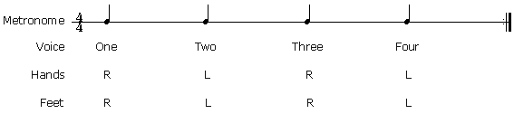

<a id="markdown-getting-to-feel-1-and-3-and-2-and-4" name="getting-to-feel-1-and-3-and-2-and-4"></a>
## Getting to feel '1 and 3' and '2 and 4'

Our next step is to take the metronome down to a tempo of 50. Now, think of each click as having a value of a half note (so the real tempo in quarter notes is 100). By using the metronome on beats '1 and 3' or '2 and 4' we have to 'feel' the other beats as there's nothing to orientate ourselves on. Check it out - do you feel the difference from our first exercise?

Metronome and feet on 1 and 3 - hands and voice on quarter notes.

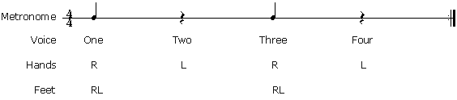

Metronome and feet on 2 and 4 - hands and voice on quarter notes.

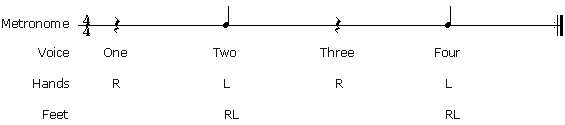

2 and 4 is a bit more tricky - it's more difficult to get into the beat by counting it off correctly.
Here's a way of doing it:

on the metronome clicks count:
```text
            two                     four
```
then add the three inbetween:
```text
            two        three        four
```
and then add the one:
```text
 one        two        three        four
```

Taking it further from the above, set your metronome to 40. We can now think of the metronome as giving us just beat four in a measure so the actual tempo is 160 for quarter notes. This requires us to feel beats one, two and three. First, just try to count the entire measure - then add your feet on 2 and 4 and finally add your hands.
Here's what this looks like:

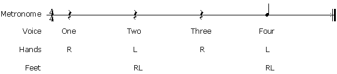


<a id="markdown-subdivisions" name="subdivisions"></a>
## Subdivisions

Based on the 2 and 4 exercise we now start to switch between subdivisions of our basic beat. The example below moves from quarter notes to 8th notes to triplets to 16ths. While metronome and feet stay on 2 and 4, voice and hands play the subdivision. First I suggest that you practice each line separately to get a feel for the rhythm. Then move up the list and back down. Also, practice switching from each single subdivision into another and back, eg 8th notes to 16th notes and back. Set the metronome to 40.

quarter notes

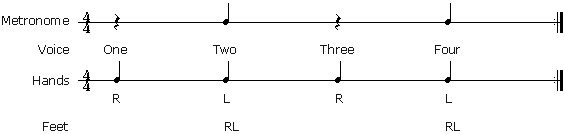

eighth notes

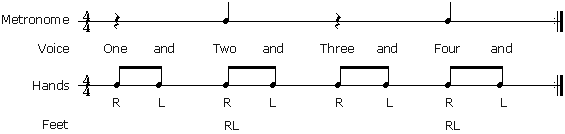

8th notes triplets

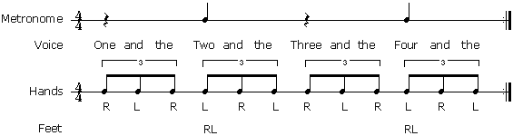

sixteenth notes

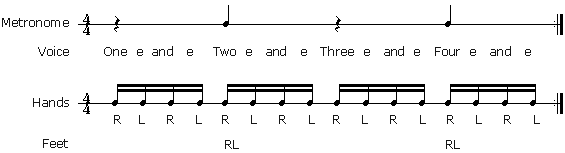

How are you doing? This is really not that easy to do but hang in there and take your time with this. The nice thing about this exercise is that you can practice this anywhere: on the street, while walking or on the bus - for quite some time I carried a metronome around with me wherever I went - it had a headphone out and whenever I had the chance I did some exercises (not to mention the odd looks I got from that old lady....)


<a id="markdown-digging-deeper" name="digging-deeper"></a>
## Digging Deeper

Finally, I'd like to show you two practical approaches on how you can apply what you just learned.

<a id="markdown-practicing-specific-rhythmic-patterns" name="practicing-specific-rhythmic-patterns"></a>
### Practicing Specific Rhythmic Patterns

I will show you an example for 16th notes which you can also apply to 8th notes, triplets, etc ....

16th pattern with metronome on the 'offbeats' (Tempo is set to 80):

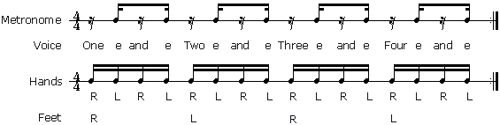

16th note rhythmic pattern played with the hands:

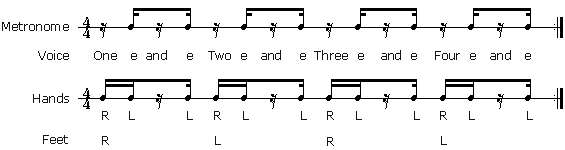

Try the above with other 16th patterns as well.


<a id="markdown-sightreading-rhythms" name="sightreading-rhythms"></a>
### Sightreading Rhythms

Using this 'body' approach is a good way to figure out rhythmically difficult phrases, although I also recommend you just practice sightreading in that way to strengthen your rhythmic ability.

Try the example below with the metronome on quarter notes, '1 and 3' and '2 and 4'.

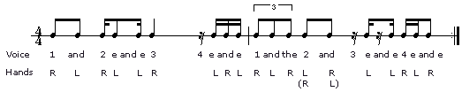

Finally, let me just mention that developing a good rhythmic sense takes the same amount of time and effort as any other skills you need to develop as a musician. The method described in this article really helped me and I hope it will also be as helpful to you.

As always, if you have any queries please don't hesitate to ask me in the forums.

Laterz,

Guni