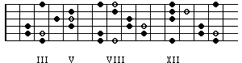
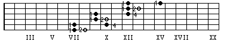

# Improvisation Tools: Arpeggios
by Gunharth Randolf  (23 Jan 03) 

- [Improvisation Tools - Arpeggios](#improvisation-tools---arpeggios)
    - [Introduction](#introduction)
    - [Part 1: Arpeggios in 5 Positions](#part-1-arpeggios-in-5-positions)
        - [Major 7](#major-7)
        - [First Drill & Exercises](#first-drill-exercises)
        - [More Patterns and Exercises](#more-patterns-and-exercises)
        - [Ideas & Exercises](#ideas-exercises)
        - [Second Drill & Exercises](#second-drill-exercises)
        - [Review](#review)
        - [Minor 7 Arpeggios](#minor-7-arpeggios)
        - [Combining Major and Minor](#combining-major-and-minor)
        - [Dominant 7 Arpeggios](#dominant-7-arpeggios)
        - [Exercises Using Chord Progressions](#exercises-using-chord-progressions)
            - [Exercise 1: creating a continuous line](#exercise-1-creating-a-continuous-line)
            - [Exercise 2: playing a specific combination of chord tones](#exercise-2-playing-a-specific-combination-of-chord-tones)
        - [Minor b5 Arpeggios](#minor-b5-arpeggios)
        - [Diminished 7 Arpeggios](#diminished-7-arpeggios)
        - [Why Arpeggios and Chord Tones](#why-arpeggios-and-chord-tones)
    - [Part 2: Enter at Your Own Risk](#part-2-enter-at-your-own-risk)
        - [Major 7 Arpeggios in 12 Positions](#major-7-arpeggios-in-12-positions)
        - [Combining Positions](#combining-positions)
        - [The Unitar](#the-unitar)
        - [2 Strings](#2-strings)
        - [Last But Not Least](#last-but-not-least)


This is the second of a series of articles to familiarize you with the tools used in improvisation. See "Improvisation Tools: Pentatonic" for Part 1 in the series. In order to get the most out of this article you should have at least some experience in improvising. 

The series of articles "Improvisation Tools" does not attempt to be a prescriptive method that specifies exactly how you should apply a particular tool to a specific chord or give you exact practicing schedules. Rather, they are intended to show you some ideas on how to approach and practice these tools.

If you have any questions, comments, suggestions or criticism please feel free to post them in the forums here at iBreathe. I hope that this article is helpful and that you have fun studying it.


## Introduction

Before we actually start working on arpeggios we have to define the term "arpeggio" and how it is used throughout this article. An arpeggio is a series of single notes that spell out a Triad or a 7th chord (For further information refer to the harmony section on this site). Notice that this article is entirely about 7th chords arpeggios, meaning the 4 different single notes that make up major7, minor7, dom7, m7b5, and dim7 . Therefore, knowledge of intervalic construction of each chord family is absolutely vital.

Whereas chordal thinking has a more vertical direction arpeggios show a strong horizontal direction and therefore are very useful in improvisation. Due to the fact that 4 note arpeggios contain all notes of a chord the term "Chord Tones" sometimes seems to be more appropriate. I will use both expressions interchangeably. For clarity: when saying arpeggio I refer to a fingering or pattern, when saying chord tones I am thinking of individual intervals that make up the chord, e.g. root or perfect fifth.

Important: You do not have to learn everything at once in this article. I encourage you to read through it and see what you can apply to your playing. Go as far as you are interested in and/or pick out the topics that you have the feeling of being helpful.


## Part 1: Arpeggios in 5 Positions

### Major 7

I don't know what your first experience with arpeggios was or if you ever had one. In my case I learned my first fingerings in close connection with 7th chord voicings and looking back I think this is a good way to start out. In most books arpeggio fingerings are presented in more or less 5 main positions. Although you may have learned different ones I encourage you to follow the fingerings and exercises on the next few pages. 

I will demonstrate everything with focus on maj7 arpeggios. At the end of Part 1 you can find the fingerings for the other chord families to which you can then apply the learned maj7 approach on your own. 

The 5 positions are demonstrated by listing the most common major7 voicing with the arpeggio next to it, so that you can set them in relation to each other. Furthermore I included the individual intervals/chord tones of the voicing and the arpeggio. Note that it is very important to learn the positions of the chord tones. On the bottom of each position I included a notation part with fingerings of the voicing and the related arpeggio. Notice that I start the arpeggio on the lowest possible root. 

1)


### First Drill & Exercises

Before you take a look at all 5 positions you should perform some exercises with each fingering. If you have finished the drill to your satisfaction, move on to the next position.

**Exercise 1**

Take the voicing and the arpeggio and transpose them through the circle of fifth, i.e., C, G, D, A, E, B, Gb, Db, Ab, Eb, Bb, F, and back to C. Play the maj7 voicing first followed by the arpeggio. I recommend the use of a metronome. Try to bring the rests between voicings and arpeggios to an absolute minimum.
Example: Metronome bpm = 80 -100


**Exercise 2**

Improvise with focus on chord tones. This exercise will help you to memorize the location of individual chord tones in each position. 

Record a Cmaj7 vamp (3 minutes) -- now let's say we focus on the root. Try to improvise using only the note C . Our first fingering includes twice the root which are an octave apart (on A and g string).

Now take the 3rd (E), 5th (G) and 7th (B) and repeat the procedure.
Then take combinations: Improvise with roots and 3rds only -- or 5th and 7th.

Transpose the exercise in different keys. I recommend to think in numbers and not in note names because the location of the Chord tones in relation to the root stay the same independent from the position you are in.


### More Patterns and Exercises

2)

Repeat the above exercises with this position

3)

Repeat the above exercises with this position

4)

Repeat the above exercises with this position

5)

Repeat the above exercises with this position


### Ideas & Exercises

We have already spent some time with our 5 different arpeggio fingerings. Up to now we have played them more or less up and down. Here are some examples of "breaking up" the patterns (for a detailed explanation of the exercises below refer to my article about the Pentatonic).

All examples are shown using the Cmaj7 pattern in 5th position (#2 from above).

**4 - Note Sequence**  


**3 - note Sequence**  


**In "3rds"**  


### Second Drill & Exercises

**Exercise 1**

We repeat the first exercise from above. Use the circle of fifth. The only difference is that we do not move the patterns around on the neck, instead we try to stay as close as possible in positions. Play the major7 voicing followed by the arpeggio.


**Exercise 2**

With this exercise we try to create a continuous ascending and descending line by changing from one pattern to another. In the example below I switch between Cmaj7 and Gmaj7. Try to connect the two different fingerings as smoothly as possible.


- Try the above exercise by starting on every individual chord tone of the Cmaj7 Arpeggio.
- Try this exercise with different maj7 chords and/or use the circle of fifth.


### Review

All right. We have learnt 5 fingerings for the maj7 arpeggio, done some drills and applied technical exercises. Two patterns had the lowest root on the low E string, two on the A string and one on the D string. I owe you an explanation why these are the main 5 patterns. If we take a look at the entire guitar neck and project all 5 Cmaj7 patterns on it, we see that these 5 patterns contain all Chord tones that are spread over the neck. Furthermore you see where common tones of neighboring patterns are.

Cmaj7 on the neck




You can include another pattern into the above neck diagram that incorporates open strings . Move the pattern that starts on the 12th fret (in the black circle) down by one octave.


### Minor 7 Arpeggios

It is a good idea to see these patterns in close relation to the 5 Pentatonic patterns (see Improvisation Tools - Pentatonic. There is only one note difference between Minor Pentatonic and Minor Arpeggio -- Minor Pentatonic includes a Perfect 4th).

Quick repeat: Minor7 = 1, b3, P5, b7, Cm7= c eb g bb

Cm7 Voicing


Cm7 Arpeggio


It is obvious that you should apply all major exercises to minor. I encourage you to examine each individual fingering regarding their intervalic structure. Here are some examples:
- Where are the minor thirds in the patterns and which fingers play them?
- Imagine you only know roots and fifth. Improvise with them.
- What is my highest / lowest chord tone in each pattern?
- Practice 4- note sequence, 3- note sequence, and exercise in "3rds".
- Apply all drills and exercises to the minor arpeggio fingerings.


### Combining Major and Minor

Here's an example of how you can apply one of the drill exercises to major and minor. Try to play a continuous line and think of the chord tones you resolve to when changing the chord (and fingering).


Other combinations: 
I Am7 I Cmaj7 I
I Fmaj7 I Em7 I


### Dominant 7 Arpeggios

The third chord family are dominant seventh arpeggios. There should be no need to say that you should repeat all steps introduced with major arpeggios (and hopefully practiced with minor too).

Quick repeat: Dominant7 = 1, M3, P5, b7, C7= c e g bb

C7 Voicing


C7 Arpeggio


If you want to focus entirely on Dominant7 arpeggios you could practice them by using a basic Blues progression:


C7 Blues
```text
I C7  /  /  /  I /  /  /  /  I /  /  /  /  I /  /  /  /  I 

I F7  /  /  /  I /  /  /  /  I C7 /  /  /  I /  /  /  /  I 

I G7  /  /  /  I F7 /  /  /  I C7 /  /  /  I G7 /  /  /  I
```

- Try to adapt the drills and exercises we talked about.
- Improvise with focusing on single chord tones.


### Exercises Using Chord Progressions

At this point would be a good idea to actually start working on commonly used chord progressions. Major 7, Minor 7, and Dominant 7 are the most important chords to create the harmonic context used in Pop/Rock/Jazz tunes.

Common diatonic chord progressions are:
```text
                    IIm7    V7      Imaj7 

Example in C major  Dm7     G7      Cmaj7

Example in G major  Am7     D7      Gmaj7
```
```text
                    VIm7    IIm7    V7      Imaj7

Example in C major  Am7     Dm7     G7      Cmaj7

Example in Bb major Gm7     Cm7     F7      Bbmaj7 
```
```text
                    IIIm7   VIm7    IIm7    V7   Imaj7

Example in C major  Em7     Am7     Dm7     G7   Cmaj7

Example in Eb major Gm7     Cm7     Fm7     Bb7  Ebmaj7
```


#### Exercise 1: creating a continuous line

Here is an example of starting on the root of Dm7 in ascending direction:


Starting on the Fifth of Dm7 in descending direction:


Try the exercise by starting on all chord tones of the Dm7 chord. 


#### Exercise 2: playing a specific combination of chord tones

This whole exercise is based on the idea to take different combinations of the four chord tones and play it throughout the chord progression. 

As an example, here is the 1 3 5 7 combination.


or 1 5 3 7


This is a challenging exercise. It really forces you to think about what you are playing. Make up your own combinations. They don't have to start on the root.
If you are still with me and haven't trashed the article by now the next logical step is that you apply the exercises on the last two pages to real tunes. It's a great way to learn the overall sound of the chord progression.

Here are the 5 patterns for m7b5 and dim7 arpeggios to complete the fingerings for all chord families.


### Minor b5 Arpeggios

Quick repeat: Minor7b5 = 1, b3, b5, b7, Cm7b5= c eb gb bb

Cm7b5 Voicing


Cm7b5 Arpeggio


### Diminished 7 Arpeggios

Quick repeat: o7 = 1, b3, b5, o7, Co7= c eb gb a (bbb)

I have decided to not include the diminished fingerings for two reasons; firstly because you already have enough material to work on. The second reason is that they are a special case. As described in the article "7th Chords" each of the chord tones of a diminished chord can be the root; therefore there are only 3 different diminished arpeggios to include all 12 notes that can be the root. Don't bother with them for now! If you have worked through the other chord families and understand the way arpeggios are constructed you should be able to figure them out on your own. 


### Why Arpeggios and Chord Tones

"That's not fair! I worked through all this stuff and now you tell me what it is good for?!?" Well, not exactly. The thing is that I wanted you to work through this part because you need to get down the fundamentals of arpeggios. 

Nowadays we are overwhelmed by information on how to improvise -- Guitar articles, interviews, Web Sites, books, videos, schools, CD Roms, etc. It gets very difficult for individuals to choose from this infoflood. "Steve Vai plays Dorian" and John Abercrombie says his improvisation is based on chromatic. In "Guitar Player" you see some altered licks and all together you have the feeling that the more you know and practice the more confused you become. 

I was in this situation. Berklee was the worst and best experience at the same time. In the first semester I had a teacher that made me go through all modes and scales: "You got to know all your scales!" -- I practiced them. The second semester I told a teacher that I was interested in the style of Larry Carlton. "No problem. You have to learn Triads" -- I practiced them. This little game went on and on with the result that I felt my playing gets worse than worse. I stopped playing and started thinking. The result was that I threw away all influences and judged improvisation tools based to their importance to me. It looked something like this:

**Scales**: Nope -- too many notes -- tend to be played up and down.

**Triads**: Nope -- too few notes -- the sound of a 7th chord progression doesn't stand out

**Pentatonic**: Nope -- Great for playing over chord changes in Blues and Rock, but no good for playing through chord changes and examining what I'm doing.

**Arpeggios**: Yup -- made immediately sense, a few thoughts:
- Arpeggios are linear translations of chords. If i don't know how to play and hear these chords how can I think about adding any Tensions or playing outside.
- Arpeggios are technically challenging and their intervalic structure gives an interesting sound (to me).
- Arpeggios kept me away from playing over and over the same licks. It opened new views in terms of fingerings and musical ideas.

I then started to explore Arpeggios on the entire neck, practiced entirely to play with these chord tones. After a couple of months I found that this was the right way because I could hear and sing what I was playing. Now I could add specific tensions and set the other improvisation tools in relation to the frame that I built up with arpeggios.

What I'm getting at is that these are incredibly important considerations that you have to go through at some point. Whether you decide to focus on scales or pentatonics is irrelevant. What is key is that you go through this step, one which nobody can help you with, and focus on the thing that is the most important to you.


## Part 2: Enter at Your Own Risk

**!!! WARNING !!!**

**FOR MAD(WO)MEN ONLY**


Well, well, you really want to ignore the warning and declare yourself as a madman.

Welcome to the club! 

Before you take the challenge and work through the second part of the article I highly recommend that you have already spent some time with the first chapter. If you feel comfortable with the different patterns for all chord families (I mean all, not only maj7) you can take the next steps to work with arpeggios on the entire neck. In this part I describe the way I took to really deepen the topic arpeggios / chord tones. This method covers the experiences and experiments of approximately 4 years (and I am not done with all possibilities). So take your time with it. Think about whether this stuff makes sense to you and how you could apply it to your playing.

The goal we are trying to reach is to attain a kind of freedom on the guitar neck, meaning the ability to play freely without thinking in positions and focusing more on possibilities of how arpeggios can be played. You will find a lot of similar thoughts in the article about Pentatonics.
I will explain every topic by using the Cmaj7 arpeggio. 

Enough talk. Let's jump right into it.


### Major 7 Arpeggios in 12 Positions

Before combining the different patterns we have to explore all possibilities of playing in position. One characteristic of arpeggios is that they can be played in every position on the guitar with a reasonable result regarding fingering. But first we have to define the word position:

**The actual position you are in is determined by a half step below the location of your 2nd finger. When your 2nd finger is on the 3rd fret you are in 2nd position, when it's on the 7th fret you are in 6th position.**

Here are the 12 positions and fingerings for Cmaj7 without using open strings. Notice that some positions are very closely related and need only a different set of fingers to be played.


If you are up to it, you can apply the exercises on page 8 to all 12 fingerings - but don't get too carried away with it. It's more that you are able to see how the different fingerings cover the entire neck.

**Exercise 1**: take a chord tone out of the Cmaj7 chord, play this note with your 1st, 2nd, 3rd, and 4th finger and examine which pattern you are in.

Example: b on the high e string


Repeat this exercise
- with all chord tones of the Cmaj7 chord
- by starting on each individual string
- with different maj7 chords


**Exercise 2**: improvise with focus on what pattern you are playing

There are different ways how you could approach this exercise.
here's an example:
- record a Cmaj7 vamp
- start improvising using the pattern in 2nd position.
- after a couple of bars move up to the 3rd position
- then move to 4th position etc...

It is important that you focus on the fingerings and on picturing the patterns (don't be discouraged if the musical output is not that great).


### Combining Positions

Our next step is to look for ways how the different arpeggio fingerings can be connected.

If you have read the article about Pentatonics you know my way of approaching directions on the guitar (if you haven't read it, I encourage you to do so).

A quick review: I compare the directions of a compass with a view to playing directionally on the guitar.


Playing vertically up and down in position equals playing in the S<-->N direction. Playing horizontally on one string equals W<-->E.

All right. We already did a lot of playing in the S-N direction, meaning learning the different patterns and fingerings and applying exercises to them.

Let's have a look at diagonal directions.


**SE<-->NW**

Well, to be honest I don't see a lot of possibilities here. The fingerings are somehow uncomfortable. That doesn't mean they are worthless. Maybe I haven't explored all the possibilities and these fingerings make more sense to you. With the example below I try to connect position V and IV . Take a look at the spread between your 2nd and 3rd finger on the A string (that can hurt).

Cmaj7


**SW<-->NE**

This is by far the most important diagonal direction. 
Here are two examples for combining two neighboring patterns.

**Example 1**: combining position II and III on the A string.

Cmaj7


Try to use a slide with your first finger on the A string .


**Example 2**: combining position II and III on the g string.

Cmaj7


An interesting combination of different patterns is created by using 2 notes on each individual string. This reminds me of our pentatonic patterns except that there are position changes involved with arpeggios. Are there any exercises applied to the pentatonic that I can use with Arpeggios? Take a look at the "Ideas & Exercises" in the Pentatonic article.

Using 2 notes per string results in four different fingerings. One for each chord tone as the starting note. The range is nearly 3 octaves. Watch out for the position changes and start practicing at a very slow tempo.

Cmaj7 Starting Note: E (open string) 


Cmaj7 Starting Note: G


Cmaj7 Starting Note: B



Cmaj7 Starting Note: C


### The Unitar

I got this word from the incredible book "Advancing Guitarist" written by Mick Goodrick. It's a great expression for what is coming up next. We check out the Cmaj7 arpeggio on one single string and look for possibilities. Applied to our compass we are using the W<-->E direction. 

Cmaj7


- Record a Cmaj7 vamp and improvise with focus on chord tones.
- Experiment!


### 2 Strings

Far more interesting in terms of possibilities is a combination of 2 strings. Here's the neck diagram for Cmaj7 on strings e and b.

Cmaj7 on e and b string


If you take a closer look at it and imagine how you could play and combine the notes above you may feel a little bit lost due to all the possibilities. Let's bring some kind of order into this mess. There are two main ways I can play on 2 strings: single notes and two notes at a time (Double Stops).


**Single Note Lines**

For my part I divide single note lines in 2 categories (more or less):
- 2 notes per string
- 2 notes on one string, 1 note on the other string


Examples for 2 notes per string


4- note sequence


Examples for 2 notes on one string, 1 note on the other

2 notes on b string (3-note sequence)


2 notes on e string (compare this example with the one above)


Well, I hope you can see and imagine that there are tons of possibilities. Try to make up your own lines, incorporate slides or/and hammer-ons, and have fun with improvising and exploring.


**2 Notes At The Same Time**

You can think of this in different ways:
- Double Stops
- Micro Voicings (as part of Cmaj7)
- Intervals (in relation to Cmaj7)

Personally I think of them as intervals set in relation to Cmaj7. What do I mean by that? I take an interval within the Cmaj7 arpeggio and try to move it to each individual chord tone. Sounds really complicated. There's only one way to explain:

Example: Thirds within the chord tones of Cmaj7 


We get two major thirds (c-e; g-b) and one minor third(e-g). Due to the fact that there is no third available starting on the note b the result is a minor second (b-c, pretty dissonant). 

I think you will understand what I did above. Try to figure out other intervals within the Cmaj7 Arpeggio (fifths for example).

One thing I want you to realize is that with the technique above you actually create voicings that you could use in improvisation as well as in accompanying a tune (likely be used if you have another instrument playing fuller versions of the chord).

This is our last example for this article: it has a classical touch. Watch out for the sustained notes. Although I included the tablature you should focus on the notation to get this lick right. Examine what intervals are used when 2 notes sound together.


### Last But Not Least

Imagine the possibilities that will emerge when you examine arpeggios on three strings. You will discover triads that are part of the Cmaj7 and use them for comping. You could come up with licks that sound "out" because of their intervalic structure although you only use chord tones. 

If you want to incorporate tensions you could work trough this whole article all over again by adding Tension 9 (for Cmaj7 this would be d) into all patterns and exercises. And then you have to apply everything to other chord families. There are no limitations to exploring.

Enough is enough!

I hope you have discovered some ideas and ways how arpeggios can be practiced and looked into. Feel free to post any comments regarding this article in the forums.

Best wishes,

Guni
