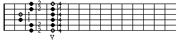
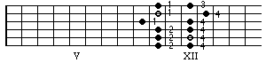
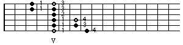

**Contents**

<!-- TOC -->

- [Introduction](#introduction)
- [What is this Pentatonic Thing?](#what-is-this-pentatonic-thing)
- [Five Pentatonic Patterns](#five-pentatonic-patterns)
    - [The "Rock Hall of Fame" Patterns](#the-rock-hall-of-fame-patterns)
    - [The "Smooth" Patterns](#the-smooth-patterns)
    - [The "Awkward" Pattern](#the-awkward-pattern)
- [Exploring the Patterns](#exploring-the-patterns)
- [Ideas and Exercises](#ideas-and-exercises)
    - [Up and Down](#up-and-down)
    - [Sequences](#sequences)
    - [Intervalic Sequences](#intervalic-sequences)
    - [String skipping](#string-skipping)
    - [More Ideas](#more-ideas)
- [Exploring the Neck](#exploring-the-neck)
- [Diagonal Playing](#diagonal-playing)
    - [SW <-> NE](#sw---ne)
        - [Combining 2 Patterns](#combining-2-patterns)
        - [Combining 3 or More Patterns](#combining-3-or-more-patterns)
    - [NW <-> SE](#nw---se)
    - [Interim](#interim)
- [Horizontal Playing](#horizontal-playing)
    - [Playing on One String](#playing-on-one-string)
    - [Playing on Two Strings](#playing-on-two-strings)
- [Adding Spices to The Pentatonic](#adding-spices-to-the-pentatonic)
    - [Spice No. 1 - Diminished Fifth (b5)](#spice-no-1---diminished-fifth-b5)
    - [Spice No. 2 - Country Scale](#spice-no-2---country-scale)
- [Pentatonic Outlook](#pentatonic-outlook)
    - [Superimposing](#superimposing)
    - [Other 5 Note Scales](#other-5-note-scales)
- [Final Considerations](#final-considerations)

<!-- /TOC -->

## Introduction

This is the first of a series of articles to familiarize you with the basic tools used in improvisation. In order to get the most out of this article I highly recommend that you have at least some experience in improvising. 

The series "Improvisation Tools" does not attempt to be a prescriptive method that specifies exactly how you should apply a particular tool to a specific chord or give you exact practicing schedules. Rather, they are intended to show you some ideas on how to approach and practice these tools.

If you have any questions, comments, suggestions or complaints please feel free to post them in the iBretheMusic forums. I hope that this article is helpful and that you have fun studying it.

---

So what's the big deal ? Why are Pentatonics so important to us guitar players ?

A few considerations:
- Pentatonic has it's distinctive sound, i.e. its intervallic structure gives a certain mood that you are familiar with by listening to Rock, Pop, Blues, Country, Jazz , etc.
- Pentatonic fits perfectly on the guitar. When we talk about the 5 guitar patterns you will see that there are always 2 notes on a string that makes them easy to locate on the guitar and favors technique.
- Pentatonic is an easy tool for incorporating guitar specific effects like bends, slides, hammer-ons and pull-offs.
- Best of all is that Pentatonic goes along with the guitarist's desire for blowing over diatonic chord changes.

Don't get me wrong: all other tools like triads, arpeggios and scales are very important, but can easily cause problems, e.g. scales tend to be played up and down resulting in a tired, non-musical performance. 

Before we start I would like to mention the time factor. Don't expect to master all this in a few weeks. Take your time with exploring things. If you have the feeling that you are not up to a topic or do not like to do it, just skip it for now and come back in one year. 

## What is this Pentatonic Thing?

Penta means five. So all pentatonic scales are 5 note groupings. Although there are many different pentatonic scales we generally refer to pentatonic as what is known as Major Pentatonic (at least in the West). The 5 notes are derived by stacking intervals of a perfect fifth starting on the root.

Rearranged within one octave:

What you get is a C major triad with added major second and major sixth. The correct chord symbol is C69. (Don't be discouraged if you have no clue regarding what I'm taking about. For the purpose of this article, chord symbol knowledge is irrelevant.)

Now we arrange those notes starting from the note A. We are looking at the relative Minor Pentatonic to C Major. (A minor is the relative minor to C major because it has the same key signature and therefore the same scale notes.)

The result is a Am7 chord with added Perfect Fourth. The correct chord symbol is Am711.

As a result we realize that C major pentatonic and A minor pentatonic consist of the same notes and therefore are the same. To unnecessarily complicate things, musicians decide themselves whether they want to think in major or minor. It's up to you and depends on your experience with pentatonics. I encourage you to do a little research to find out what is the right way for you. 

In my case pentatonics are all minor. (When I was a teen I wanted to sound dark and angry. I did not need the happy major sound because there was only one chord for being dark and that's E minor. Sounds familiar ?)
Seriously, there is no wrong or right although I encountered a slight advantage by thinking in minor.

## Five Pentatonic Patterns

### The "Rock Hall of Fame" Patterns

With these two patterns you can nearly play all top 100 Blues and R&R licks.
(The numbers represent the fingers of your left hand.) 

A Minor Pentatonic

A Minor Pentatonic

For now just remember where the roots are, and especially, on what string the lowest possible root is, e.g. the root of the first pattern is on the E string and is played with the first finger. (Second pattern - root on A string - first finger). This is very important if you have to play in a different key. If you prefer to think of the above as C major pentatonic the root for the first pattern is on the E string - fourth finger; Second pattern - root on A string - fourth finger.

### The "Smooth" Patterns

I call them smooth because personally I like the feel of the fingerings.

A Minor Pentatonic

(Root is on D string - first finger)

A Minor Pentatonic

(Root is on E string - fourth finger)

### The "Awkward" Pattern

I call it awkward because the fingerings are not that obvious. Either you have to master a position change or a stretch.

or

(Root is on A string - third or fourth finger)

## Exploring the Patterns

Now we start actually working and researching. Record a diatonic progression (e.g. Am - F - C - G) and examine each Am pentatonic pattern on its own by playing and improvising with it. A good thing would be if you take one pattern at a time. Maybe take a week to work on one pattern and see what you come up with. Then try to apply your ideas to a different pattern. So after 5 weeks you should be pretty familiar with all five pentatonic patterns.

A list of things you can look for:
bendings / slides / hammer-ons / pull-offs / two notes at a time (double stops) / etc...

You will find out that each pattern has its own character. For instance bendings are great for the two patterns in the "Rock Hall of Fame" category, whereas they are more difficult to incorporate in the smooth patterns.

Transposing

The next very important step is to be able to transpose the already learned patterns. It would be embarrassing if we are the kings of Am and ask for the bathroom when we have to play in C#m.

A quick test: 

There are two patterns that have their root on the E-string. Play them in the key of Am. Now play them in Em, Bm, Gm, Cm etc...

There are two patterns that have their root on the A-string. Play them in the key of Am, Em, Bm, etc...

There is one pattern that has its root on the D-string. Play it in Am, Em,etc...

Now record a progression that incorporates all 12 minor chords in a relaxed tempo. For each chord record 1 measures to give you enough time to think.
Example:

||: Cm | Em | Abm | Bm | Ebm | Gm | Bbm | Dm | F#m | Am | C#m | Fm :||

Let's say you start on the Cm pattern in fifth position. (This is a "smooth" pattern. The root is on the E string and is played with the fourth finger. All right, all right ! You know this already ....just wanna make sure.) 

Our goal is to connect the different patterns as smoothly as possible and as close as possible to the position we started out by playing constant 8th notes.

Example:

If you can do it in 5th position take a different C pentatonic pattern and start all over. Go through all five positions.

I know it's though but this is the only way to dig into it and visualize the five different patterns.

## Ideas and Exercises

Rule number one for all exercises is to use a metronome. All examples are shown for the A minor pentatonic in fifth position. Be sure to practice them with all five patterns.

### Up and Down

Variation 1

Variation 2

### Sequences

Sequences are used a lot. They sound great because they break up the pentatonic into smaller subdivisions. As an example I'll now show a 4 note sequence, meaning that you play up 4 notes, think back 3 notes and play up 4 notes again, etc. 
4 up / 3 back / 4 up ....
Watch out for the rolls that your first and third finger have to master in order to make the sequence sound clean.

Ascending

Descending

Another sequence that is commonly used is the 3 note sequence. Play three notes up, think back two , play three notes up, etc. (3 up / 2 back / 3 up ....)

Furthermore, you can check out 5 and 6 note sequences or any other number that you can think of.

### Intervalic Sequences

Intervalic sequences are use primarily with scales. But I think they sound great applied to pentatonic. The formula for the example below is to skip a note, play the next one, think one step back and repeat the process. (Applied on a scale, this is known as "sequence in thirds"). The result is that you get mostly intervals of a perfect fourth and an "open" sound. (The exception is C to E , which is a major third.)
Again, watch out for the finger rolls ! Figure out how this sequence works descending.

Other intervalic sequences you could try:  
skip 2 notes - mostly fifth  
skip 3 notes - mostly sevenths  
skip 4 notes - all intervals are octaves

### String skipping

There are a lot of possibilities to incorporate this technique. It's a great way to create interesting lines. Experiment !

### More Ideas

- Start again with exercise 1 and incorporate Hammer-ons and Pull-offs where you think it is appropriate.

- Start again with exercise 1 and play all exercises with different rhythmic subdivisions other than eight notes,e.g. triplets, sixteenth, etc....

- Start again with exercise 1 and ask yourself: "Do I like that ?" . If yes put it into your "I could play" bag.

- Write E- mail to the guy who told you to do all of this and ask him whether he is nuts to put such a load of work on your shoulders.

## Exploring the Neck

Before starting this chapter you should be very familiar with the five different pentatonic patterns. 

Now take your guitar, lay it down in front of you on a table and take a look at the fret board. Think about in what directions you can actually play. Thinking about a compass will help us:

Applying the compass directions to our guitar neck that means that in the whole first chapter of this article we were playing in the N - S direction, e.g. up and down. Our goal is to forget about positions and patterns and be able to play freely in all directions. I can not overemphasize how important this is.

Now that we are familiar with the different patterns we take a look on how they relate to each other. It is helpful to divide each pattern into two halves. Each half is a half of another new pattern. If your thinking is similar to mine you did not understand a word and therefore we shall do an example:

**Step 1**: We take the Am pentatonic in 5th position and divide it into 2 halves.

**Step 2**: Each half is part of another pentatonic pattern.

Am Pentatonic Neck Diagram

You can think of all pentatonic patterns as pieces of a jigsaw puzzle. Below is the "picture" you get when you successfully put them together.

## Diagonal Playing

### SW <-> NE

#### Combining 2 Patterns

Let's take a closer look at two neighboring patterns.

In order to combine the two patterns we practice the change on each string from one pattern to the other in ascending as well as in descending direction. This is a good exercise for practicing position changes and finger stretches. In the beginning I recommend that you use the shown fingerings. Use alternate picking and don't forget the metronome.

E - string

A - string

D - string

g - string

b - string

e - string

If you feel comfortable playing the position changes, try to incorporate slides instead of the stretches on the string where you change the pattern.

Things to do:
- incorporate slides
- incorporate hammer-on and pull-off 
- go back to the "Ideas & Exercises" page and apply this to these pattern
- take the next pair of neighboring patterns and repeat the procedure

#### Combining 3 or More Patterns

I think you can see where this is going. We just pick three or more patterns and combine them. If you went through all "two pattern" combinations this is a logical result and will not be very difficult. Just try to apply everything we talked about earlier like 4 note sequence to the new "picture".
One tip: Keep the original patterns in mind when playing combinations to prevent you from getting lost.

Example1: combining 3 patterns

Example2: combining 5 patterns 

### NW <-> SE

I have seen just a handful of guitar players using this direction and (surprisingly?) they are well known in the guitar world (Of course this is not the only reason !). In comparison with the first mentioned diagonal direction it offers opportunities to use different guitar techniques more effectively (e.g. sweeping). Although some of the fingerings are more or less useless because of stretches, I encourage you to explore these possibilities and see what you can come up with. 

Example for combining 2 patterns:

As an example, I'll now show you the change on the g string. Note that there is only one note on the string where you change the pattern.

Example for combining 3 patterns
The strings which are used to change patterns are the D and b string.

### Interim

I know this is a lot of information. Although it might not be challenging to understand, it will be very challenging to project this knowledge onto your guitar - combining all patterns, being able to play this in all keys, making it musical, giving it your own touch, etc...

"So where does it end and when will I be able to say I mastered this stuff ? Do I have to master this stuff ?" Good questions and my answer is "I don't know." You have to understand that you mix the cards and you are the only person to decide what is the right way for you. It all depends on your goals and where you want to go with your music and guitar playing. My job is to show you possibilities and ways to get more familiar with your instrument. The only advice I can give to help you is that you have to make selections and decisions and, more importantly, focus on mastering those things you do decide to do.

## Horizontal Playing

The two directions that are missing in order to complete all the compass directions are east and west. Applied to the guitar this means playing horizontally up and down the neck.

Remember the first day you touched a guitar ? Didn't you move your first finger of your left hand up and down on one string trying to play some melodies ? This "instinct" is soon pushed away by learning to play and think in guitar positions. Believe me when I say that the more you know about guitar and music the more important it is to be able to play in a horizontal direction. It frees you of position limits and opens your mind (ears) to create more melodic lines.

### Playing on One String

Am pentatonic on high e string

Now we have limited our Am pentatonic by using only one string. 

Some thoughts:
- Imagine you can use only one finger of your left hand and you don't know what slides are.
- Use one finger and the only thing you are allowed to play are slides.
- Are there exercises from the "Ideas and Exercises" page that you could play on one string ?
- How about tapping ?
- How could you incorporate the open string ?
- Can you play at all when closing your eyes ?

I suggest that you make up some exercises on your own and practice the Am pentatonic on each single string

### Playing on Two Strings

Am pentatonic on e and b string

Playing on 2 strings offers many more possibilities and it would be beyond the scope of this article to list them all. The main difference is that you can incorporate double stops (two notes at a time). I encourage you to experiment a lot with 2 strings. All guitar specific challenges e.g. picking can be practiced and improved. It will be much easier to use all six strings when you have experience with two strings. 

Enough ! I think you get the point . I don't want to get carried away with details. The important thing is that you are aware of the directions on the guitar that are available to be explored.

## Adding Spices to The Pentatonic

Spices? Salt and pepper? Blue notes?

You can think of our pentatonic patterns as a big frame. All notes are (more or less) "save notes" meaning they will sound good. 

Experiment: Record a Am vamp (as long as possible) and improvise with the Am pentatonic. How long can you play until you get bored. 5 minutes, 10 minutes, more? The problem is that you are limited to 5 notes and what ever you do (add more distortion, play faster etc... ) will not change the mood. 

Note: all listed spices have to be used as passing tones. Always resolve them to a note contained in the pentatonic. 

### Spice No. 1 - Diminished Fifth (b5) 

The recipe is to take the existing patterns and fill in the diminished fifth. This note is also called Blue Note.

Am pentatonic + b5

The resulting "picture" (pentatonic + b5) is known as the Blues Scale.

Now go back to your Am vamp and start again playing. From time to time incorporate the Blue Note. Do you like it ?

You should locate and remember the Blue Note in all 5 patterns

### Spice No. 2 - Country Scale

I learned this stuff under the name "country sale" but don't ask me why. It is not even a scale: it's a mathematical way to fill up the pentatonic with a lot of spices. 
recipe: On each string you add a note between the two pentatonic notes. If possible you should use a diatonic scale note otherwise a chromatic note.

Example:

Can you see what I did? On strings E,b and e there is space for a diatonic note. On the remaining strings I have to use chromatic notes. I would not go that far and analyze each note in relation to Am. Use it as a tool to break out and play a little bit "outside". Remember that you have to resolve to a pentatonic note otherwise it will sound like a mistake. Apply the recipe to all 5 pentatonic patterns and try to come up with some licks that you can incorporate in your improvisation.

## Pentatonic Outlook

Not enough to work on ? Still eager to increase your knowledge ?

I really had some doubts as to whether I should include this final information, but I think for some of you it could be interesting. I will give you a brief survey of common techniques that are used in improvising with pentatonics.

### Superimposing 

Example for Superimposing:
Up to now we've been talking about playing Am pentatonic over a Am chord. A common technique is to use Em pentatonic instead. So your chord is Am but the notes that you are using for your improvisation spell out the Em pentatonic. What for ? Well, if you compare the notes of Am and Em pentatonic you will see that there is only one note different. In Am you have a C that is replaced by the B in Em which is in relation to Am tension nine. The result is a different mood. Another advantage is that you can play all your hip pentatonic licks in Am as well as in Em and still improvise only over Am. So you can double your ideas.

### Other 5 Note Scales

As mentioned in the beginning pentatonic is a combination of 5 notes. Knowing that we could construct pentatonics that fit special chordal needs.

Example: Let's say we have to improvise over A7. Now we have to build a five note scale that fits the chord. A7 consists of four notes (a, c#, e, g) and as the fifth note I choose tension 9 (b). Note that you still get 2 notes per string, i.e. we can apply everything we learned about minor pentatonic to this new pentatonic.

A7(9) pentatonic: 

## Final Considerations

I hope you realize that you can apply most of the techniques introduced in this article to all improvisation tools. If you are working on scales and arpeggios, apply the concept of this article to scales and arpeggios. 

Well, that's it. Again, I'd like to welcome you to post your comments and questions in the forums here at iBreatheMusic.

Thank you and best wishes to you and your music.

Guni
