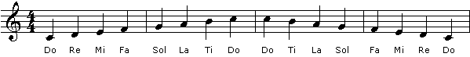
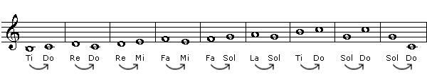
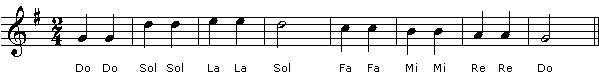
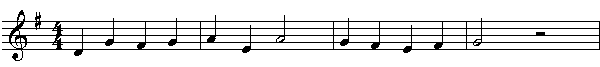
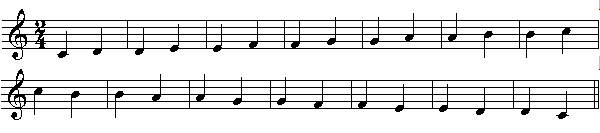
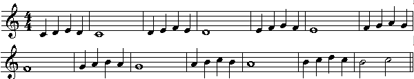
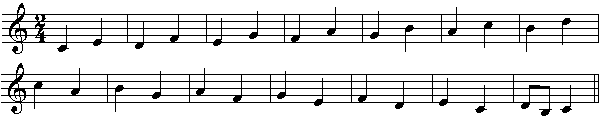
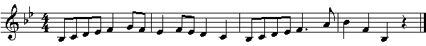

# Introduction to Solfege
by Gunharth Randolf  (20 Jul 02) 

You’ve probably all heard about Solfege as a technique for ear training. In this first article I will introduce you to the basics combined with some first excercises. I am really interested in your thoughts about this topic and how you are doing with it. Any thoughts and suggestions are welcome and can be posted in the Forums.

## What is Solfege?

Solfege or Solfeggio, is a method of assigning a syllable to every pitch / degree of a scale. Instead of singing the actual names of the notes in the scale (eg. c d e f g a b) we use the syllables instead (Do Re Mi Fa Sol La Ti). There are a few different versions of Solfege in use but I will show you the one I got introduced to at Berklee College of Music.

## Quick History

Solfege was created in the 10th Century to help monks to easily learn the chants for the mass. Guido d' Arezzo was having a difficult time teaching his monks the Gregorian Chants for the weekly mass services. He devised a system of placing the notes of the scale on his hand. Each note had a symbol on a different part of his hand. In this manner, he could point to a symbol on his hand and the young monks would sing the corresponding note. An entire song could be sung just by pointing to the different parts of his hand. The 
"Guidonian Hand" was widely used in Europe. In the 1600's the French standardized the use of solfege as we know it today.

## Why Solfege?

Well, we are not about to learn some Gregorian Chants. Our intention is to look at the advantages of using such a system for developing our ear training skills. 

Solfege is a great tool for developing Relative Pitch. Relative Pitch means that you are able to identify relationships between notes and chords in a theoretical and musical way, without actually identifying note names. If you think about harmony we are using a similar approach by giving arabic numbers to intervals and roman numerals to chords. Solfege is just an aural version of this system.

Another positive aspect of using Solfege is that it will help to improve your sight reading skills - not only in terms of singing but also on your instrument. In this article I will mostly talk about using Solfege in a melodic setting but it can also be applied to rhythm.

## Moveable DO System

We will use the 'movable Do system'. This means that the root of any given scale becomes 'Do', eg in C major the note c is Do, in F major f is Do, etc. The advantage of applying movable Do is that we auraly learn musical relationships independent of the key we are in, ie Do - Mi will always be a major third, Do - Sol always a perfect fifth. 

## Before we start ...

Before we start performing some exercise and getting used to Solfege let me point out a few important things:

- Take it seriously: It will take some time to get used to this system but once you get over the first hurdles you will see some major improvements quickly.
- Get into a practicing mindset: Add Solfege to your daily practicing routine and develop your own exercises.
- Don't be afraid of singing and use your voice as best as you can.
- Record and double check everything you sing.

## Let's sing

First of all let's get used to the syllables by singing major scales up and down. Play the root of the scale with an instrument (preferrable a piano), pick an octave that fits your vocal range and choose a relaxed tempo.

C major scale

Ok, I think it's best to show you how this sounds. I don't consider myself a singer at all and I'm a heavy smoker :-) But again, we should not be embarressed by our singing... so here it is: [Guni's Chant](audio/introduction-to-solfege/01.mp3)

<audio controls>
  <source src="audio/introduction-to-solfege/01.mp3" type="audio/mpeg">
Your browser does not support the audio element.
</audio>

Ok, pretty straight forward so far. But Stop! Already in this simple exercise there are some hidden traps. Make sure that you don't sing flat or sharp. To test this follow these steps:

1) Play Do on the piano. Sing Do - Re. Check your Re on the piano. Sing Re - Mi. Check your Mi on the piano. etc...

2) Play Do. Sing up the scale to the second Do. Check this Do with the piano.

3) Proceed in the same way downward.

Now write out the same exercise from above in the key of G. Sing the entire exercise first then double check with the piano. Then try other keys, F, Bb, etc ...

## Tendency Tones

Every note within a scale has a certain function or tendency to either be a stable note or to resolve to a stable note. Learning to hear those tendency tones is one of the first big achievements that Solfege is helping us with.

Below is a line that includes all tendency tones and their resolutions. I didn't add any rhythm as our focus should be on listening to the resolutions marked with the arrows.

[Here it is](audio/introduction-to-solfege/02.mp3)

<audio controls>
  <source src="audio/introduction-to-solfege/02.mp3" type="audio/mpeg">
Your browser does not support the audio element.
</audio>

Transpose this line to different keys. Memorize it, repeat it over and over until you feel comfortable with singin it. Can you 'feel' the resolutions? Can you feel how strongly Ti (major seventh) is craving to be resolved to Do? Yes? Cool.

## Back to childhood ...

Now here is a good way of practicing Solfege. Look for any kind of 'simple knitted' tune and sing the melody with Solfege. Get out those 'Children Song Books' hidden in the drawers and 'sightread' the music.

**Example 1**: "Twinkle, Twinkle Little Star"

Note that this tune is in G major, thus the note g becomes our Do.

**Example 2**: Well, if you recognize the tune below post the title in the forums together with an mp3 recording of you singing the melody in Solfege. The first one to do so will receive a gift (no kidding!). 

Update: Since publishing the article, we have had a good response of people posting their solfedge examples. Click here to read them or contribute your own. (the prize was awarded to Furiousnewf who responded first with the correct answer and a soundclip)

Here it is:

## More Exercises

There are many exercises based on major scales you can perform with Solfege. Let me give you a few examples. In the beginning it might be helpful to write the syllables below the notes, although we should try to avoid this as much as we can.

**Singing all the Seconds within the scale.**

**Singing melodic phrases.** Also perform this downward.

Make up your own melodic phrases!

**Thirds**

And here's an example in Bb that you can try to sightread by singing the melody with Solfege. Again, feel free to post your result in the forums if you'd like me to check it out.

## Conclusion

I hope that with this rather quick introduction I was able to give you at least a glimps of how well Solfege can be used for ear training. It's just the beginning and I intend to continue with a series of articles. 

For a taste of what's to come: In addition to what we have covered so far we will discover how to use Solfege to learn to feel / hear chords, rhythms and harmonic progressions.

Well, that's it. As always feel free to post any comments and questions in the forums.

Cu laterz,

Guni
