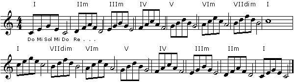
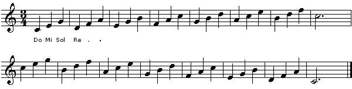
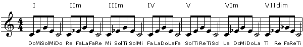
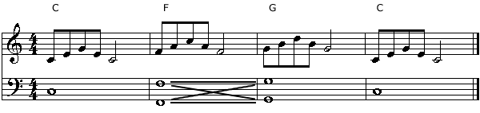
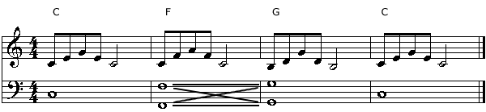
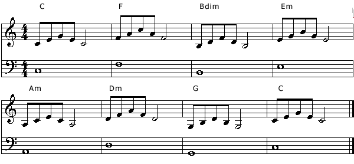
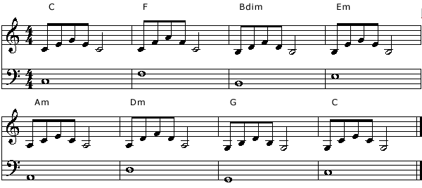
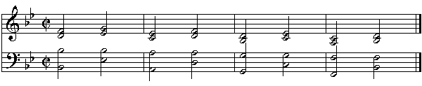

# Solfege - Part 2
by Gunharth Randolf  (12 Sep 02) 

Welcome back to Part 2 in our series about Solfege. I hope that you had some time to practice and get familiar with what we talked about in the first article.

This time we will focus on triads, chord progressions and bass lines, discovering the useful benefits of Solfege in this area.

All set with the syllables and the 'Tendency Tone' exercise? Then let's move forward.

## Diatonic Triads

First of all let's have a look at the syllables for diatonic triads.
```text
I:      Do Mi Sol

IIm:    Re Fa LA

IIIm:   Mi Sol Ti

IV:     Fa La Do

V:      Sol Ti Re

VIm:    La Do Mi

VIIdim: Ti Re Fa
```

Let's jump right in with singing diatonic triads up and down. Make sure to double check your pitch with an instrument. Also, try to bring this exercise up to pace so that the actual groups of syllables for each triad becomes like second nature. Furthermore, pick an octave range that you feel comfortable with singing in (and this goes for all the exercises).

**Exercise 1**



Here's a variation including quicker changes between the triads

**Exercise 2**




A little practicing routine: Sing exercise 1 in the key of C. Pick a new Do, say Bb. Now perform exercise 2 in Bb. Pick a new Do, say G. Now sing exercise 1 in the key of G.

For another exercise we sing all diatonic triads starting on the same note. Pick a 'Do', sing the I triad, then think of the same 'Do' as being a 'Re' and sing the IIm, etc... Here's the notation:

**Exercise 3**



## Triadic Chord progressions

The following exercises involve being able to sing, recognize and feel triadic chord progressions by arpeggiating the chords and singing the bass line.

It would be good practice to record all of the examples.

I - IV - V - I

In the example below we arpeggiate each triad, but at the same time we also want to sing the bass for each chord. Record yourself singing the bass and arpeggiate the triads on top of it. Reverse the process, record the arpeggiated triads and sing the different bass lines as indicated in the examples. And of course this all should be performed with the correct syllables....

**Exercise 4**



[Listen to my take.](audio/solfege-part2/Ex4.mp3)

<audio controls>
  <source src="audio/solfege-part2/Ex4.mp3" type="audio/mpeg">
Your browser does not support the audio element.
</audio>

In this version the bass goes down to the F, up one step to the G and up to the C. Also notice that I transposed the top staff down an octave to better fit my voice range.

Up to now we sang all triads in root position, thus starting on the root, going up to the fifth and down again. In this next example we will make use of voice leading to move smoother and more musically from one chord to the next. As a result we have to sing inversions of the triads.

Exercise 5 moves from C root position (c e g) to F second inversion (c f a) to G first inversion ( b d g) and back to C root position. 

**Exercise 5**



[Listen to my take.](audio/solfege-part2/Ex5.mp3)

<audio controls>
  <source src="audio/solfege-part2/Ex5.mp3" type="audio/mpeg">
Your browser does not support the audio element.
</audio>

Pick other common chord progressions and apply exercises 4 and 5 to these. Examples: I - VIm - IV - V or I - II - V - I or I - V - VI - IV ...

Regarding I-V-VI-IV: A few months into my studies at Berklee I met up with a couple of guys for a drink (yeah right, sometimes we did have some spare time to frown upon our hobbies :-). The juke box was playing U2's 'With or Without You'. I remember sitting there having a chat not really listening to the tune when out of nowhere I suddenly was thinking 'Ah, the bass line is Do Sol La Fa'. It's not that I didn't know this before but this was my first experience of matching sound and syllables. It just showed me that the Solfege I was practicing was sinking in. 

I mention this as I want to point out the practical side of Solfege and how it started to work for me. This was just the beginning. The more I dug deeper into this technique the more I was able to recognize and identify music by ear. 

And BTW what can be a better practice than analyzing the music that is all around us: TV, bars, radio, shopping mall, elevator, .... 
(Warning!!! Excessive Solfege may damage your sex appeal ...)


## Cycle of Fourths

Using the cycle of fourths within a key is a great exercise to practice all diatonic triads in a musical setting.

Diatonic cycle of fourths in C major: C F Bdim Em Am Dm G C

Below is Example 4 applied to the cycle of fourth. Practice this in different keys.




And here's a voice leading version:




In this next exercise our goal is not to arpeggiate the individual triads but to sing all individual voices, ie Soprano (top line), Alto (second voice), Tenor (third voice) and Bass (bottom line). Again, it's a cycle of fourth, this time in Bb.



[Listen to my recording.](audio/solfege-part2/chant.mp3) Hehe - way cool :-) I got a bit carried away with doubling the tracks and adding some reverb (apologies ...)

<audio controls>
  <source src="audio/solfege-part2/chant.mp3" type="audio/mpeg">
Your browser does not support the audio element.
</audio>


## Final exercise

Let's switch our perspective and instead of singing written music by sight, we listen to a bass line and identify the correct syllables.

[Here is a midi file.](audio/solfege-part2/bassline.mid)

Identify the correct syllables for this bass line. If you have figured them out please post your results in the Music Theory forum. And feel free to also post a recorded version using Solfege.

Furthermore, if you have any questions or suggestions feel free to post these in the forums as well. I'll be glad to answer all queries.

## Where are we going from here

If you are eager to go further with Solfege apply all exercises in this article to 7th chords.

In the next article we will expand upon our syllables and move on to minor and chromatic applications of Solfege.

That's it for now. Happy Do-ing and I'll cu in the forums.

Guni
