# Solfege - Part 3
by Gunharth Randolf  (28 May 03) 

## Review

First off let's quickly review what we've been dealing with so far in the first 2 parts of this series.

In Introduction to Solfege we discussed what Solfege is and why we use it. We proceeded to learn the syllables for the major scale and performed quite a few exercises. Again, I'd like to point out the importance of Tendency Tones and their resolutions (Don't go any further if you can't sing/feel these in your sleep!)

In part 2 we did quite a few exercises with triads, triadic progressions and the cycle of fourths.

In this third part we will expand our knowledge to the chromatic scale, ie we'll learn all the necessary syllables which enables us to sing any scale or interval out there.

All right, let's just jump right in.

## Chromatic Scale

There are 2 versions of the chromatic scale: ascending and descending. In the ascending version you will see that the main syllables that we have learned together with the major scale are altered to end off with an 'i' (pronounced: e) (leaving the first letter of the syllables in place) to fill up the missing half steps.

Ascending

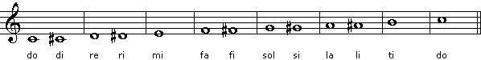

[Here's my glorious version.](audio/solfege-part3/s1.mp3)

<audio controls>
  <source src="audio/solfege-part2/s1.mp3" type="audio/mpeg">
Your browser does not support the audio element.
</audio>

(Wasn't that glorious after all - this is what my cat had to say when performing this - I guess this means No [Jazz in Catarian](audio/solfege-part3/cat.mp3) :-)

In the descending version an 'e' is added to the ending of the syllables. (pronounced kinda like an 'a'). 'ra' is the exception as we already declared 're' before.

Descending

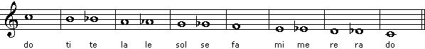

[My version](audio/solfege-part3/s2.mp3)

<audio controls>
  <source src="audio/solfege-part2/s2.mp3" type="audio/mpeg">
Your browser does not support the audio element.
</audio>

What do you think? It's really not that easy, or? This is due to the fact that we're not growing up singing chromatic stuff a hell of a lot. 

Spend some time with singing the chromatic scale - double check each note with an instrument as someone might easily fall into the habit of singing some notes flat or sharp.

## Diatonic and Chromatic Tendency Tones

This is an extension to the tendency tones exercise we got introduced to with the major scale. Added are the chromatic 'approach notes' and their resolution.

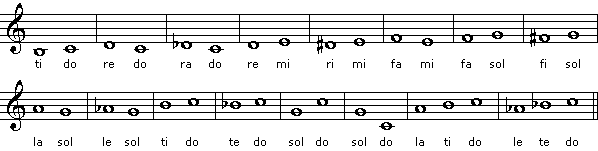

## Intervals

For the next exercise we'll sing all 'practical' intervals. Practical, as these are the intervals we come across when constructing scales. Again, take your time with this. In the descending version I also removed the syllable name as I don't want you to get into the habit of just reading them. You should be able to read the notes, not the syllables.

Ascending

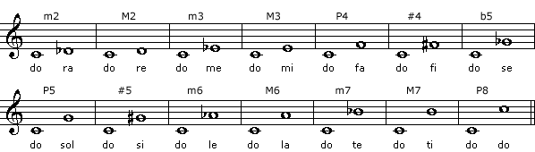

Descending

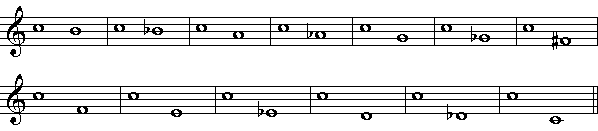

## Sightsinging Exercise

In the example below I added a few chromatic lines. Before you give it a shot let me point out a few aspects to the sightsinging procedure, i.e. how to prepare yourself before singing the first note.

1) **Establish the key**: The example below is in D major. Play the note d on an instrument and sing the D major scale up and down with its corresponding syllables. This will establish the overall sound and prepare you for what's coming up.

2) **Pick a tempo**: it should be relaxed. We tend to try speed up things too quickly in the beginning. Make sure you feel comfortable with the speed and singing the syllables in time. The exercise below uses 8th notes pretty much throughout. For a start you might set the quarter note to around 50 bpm.

3) **Count off**: Give yourself a measure up front counting yourself in to establish the tempo. At the same time try to 'look ahead' and focus on what you have to sing in the first measure. This 1 bar of preparation is considerably important. It is usually responsible for the entire performance. If this 'setting your mind at ease' with an example isn't happening chances are that your performance will not be successful and end off in a stumbling affair.

4) The one major rule: **NEVER STOP** - whatever happens. Always sing in time up to the end, even if you just sang two syllables correctly. Next time you will get three .... This is really hard to do. 'Oops, mistake! STOP - Let's start again' = WRONG. Imagine you are on stage and you made a mistake. Would you stop and play the tune again? You gotta prepare yourself that you will make mistakes - learn how to overcome them and look ahead ...

5) **Conducting**: Now this is a topic I haven't touched so far and it's beyond the scope of this article. I just want to list that here as it is another aspect of sightsinging and setting a tempo. I will at some point need to discuss conducting in detail (I guess video would be beneficial for this one). Anyway, what it comes down to is that we keep a constant tempo throughout our performance. For now you can use a metronome or/and tap the beats with your hands and/or feet (I like to snip).

Enough talk: here's the example

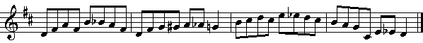

Feel free to post you results in the forum and if you have any trouble or questions - I'd like to hear them as well.

## Scales Scales Scales ...

Now that we know all syllables we can go a step further and familiarize ourselves with other scales than major.

I will just show you how you could approach this - the major work will have to be done by you alone.

In general it comes down to practicing what I have introduced to you with the major scale, i.e. sing the scale, sing intervals, sing melodic lines, etc ...

For the purpose of demonstration I will use C harmonic minor as our example scale.

1) Sing the scale up and down.

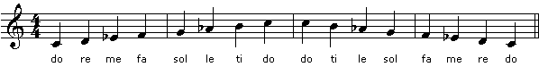

2) Pick a certain interval within the scale - 2nds, 3rds, 4ths, etc ... (In this example I'm using all 4ths diatonic to C harmonic minor)

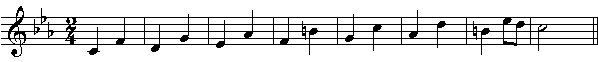

3) Melodic phrases

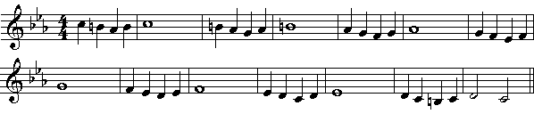

Make up your own exercises! Then apply them to other scales, ie modes, melodic minor, etc..

## One Melody - Many Exercises

As a final exercise in this article we'll have a look at a melody and how it can be used to practice different scales.

Here's the melody. 8 bars, with a pickup bar, in D major.

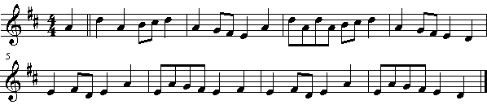

First let's perform this one - establish the key, pick a tempo, count in and sing ...

I chose this melody as it covers the entire range of an octave, thus including all diatonic scale notes. Furthermore, the melody 'circles' around the 'anchors' of any scale, ie root and fifth.

All cool with singing the above D major example? Perfect, then let's move on and sing the same exercise in D harmonic minor (key changes to F - and the note c to c#). This looks like this:

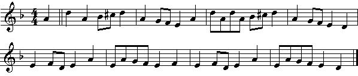

Ok, how about D phrygian? Here we go (key changes to Bb major):

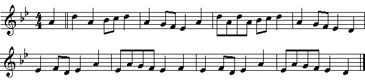

As obvious this seems it's a great way to learn the different characteristica and sound of scales. Furthermore, it's a great way to use any piece in different ways ... have you tried Jingle Bells in aeolian yet?

## Finishing off

Ok, hope I gave you some more insight into Solfege and into how you can approach practicing it. 

In the next part (Oh yeah!!! We're not done yet!) we will focus more on harmonic progressions.

Solfege Focus Group :-) ?

While writing this article I was thinking that if you are interested we could get together in the forums and post melodies or general exercises on a regular basis, which then can be used to practice Solfege. Let me know if this would be something you'd be interested participating in.

And finally ... what song is this?

Laters,

Guni