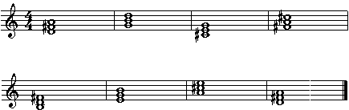

# Triads - The First Chords
by Gunharth Randolf  (10 Aug 02)

- [Triads - The First Chords](#triads---the-first-chords)
      - [Preface](#preface)
      - [Four Basic Triads](#four-basic-triads)
      - [Major Triads](#major-triads)
      - [The 12 Major Triads](#the-12-major-triads)
      - [Major Triad Inversions](#major-triad-inversions)
      - [Major Triad Chord Symbols](#major-triad-chord-symbols)
      - [Exercises Using Major Triads](#exercises-using-major-triads)
      - [Minor Triads](#minor-triads)
      - [Diminished and Augmented Triads](#diminished-and-augmented-triads)
      - [A Headache Exercise](#a-headache-exercise)
      - [Triads Within the Major Scale](#triads-within-the-major-scale)
      - [Transposing a Chord Progression](#transposing-a-chord-progression)
      - [The Cadence](#the-cadence)
      - [Suspended Third](#suspended-third)
      - [Solutions of Exercises](#solutions-of-exercises)

## Preface

As a prerequisite for this article I suggest that you have a good knowledge about intervals. It would be fatal to skip them because the theory of triads is based on relationships between notes and therefore a good understanding of intervals is essential. Refer to the article "Intervals or The Key to Harmonic Understanding" for detailed information.

If you have any questions, comments, suggestions or complaints post them in the forums. I hope that this article is helpful and that you have fun studying it.

Let's jump right into our topic:


## Four Basic Triads

Triads are constructed by stacking 2 intervals of a third on top of each other. We know that there are two possibilities of thirds: minor and major. If we check out all combinations we end up with 4 possible types of triads. We can stack a major third followed by a minor third. This is known as a major triad. A minor third followed by a major third is called a minor triad. Two minor thirds is called a diminished triad and two major thirds is called an augmented triad.

Don't worry if this sounds like jibberish. We'll go into detail in just a sec. Here's an overview of the above combinations of thirds based on the note c.


Now, let's dig deeper and examine, disect and memorize the individual triads.


## Major Triads

A major triad consists of a major third followed by a minor third. As an example let’s build a C major triad. To the Root c we add the major third e, and from e we measure the distance of a minor third. We end up at the note g, which is also the perfect fifth of c. So the whole C major triad consists of the notes c, e, g or to translate it into our intervalic number system 1, M3, P5.


Let’s repeat the same procedure with the D major triad. We already know its formula 1, M3 and P5. Now we just have to name the correct notes. Root = d; M3 = f# and P5 = a. D major triad consists of the notes d, f#, a.


## The 12 Major Triads

The following table contains all practical major triads. Print out this chart (or make your own) and fill in the blank spots. You can find a completed version of the table at the end of this article in the section "Solution of Exercises", although you shouldn't have any problems with filling this out (If you do, review your intervals!!!)

I encourage you to learn all major triads by heart. Repeat them until you can spell each triad immediately. Think about them as new vocabulary you have to learn and repeat them before you turn out the lights when going to bed. (But be sure to be alone otherwise I won’t accept responsibility for any broken relationships.)


It is important to understand that with knowing the above table, you can easily create any other major triad from any root not mentioned above. Say for example C# major triad. We very well know how to spell out the C major triad: c e g. Now the only thing we have to do is add sharps to all of the notes, ie c# e# g# and we get our C# major triad.

Another example: F# major triad. First we think about the triad without the #, ie F major triad is f a c. Now let's add the sharps. F# major triad is f# a# c#.

And another one: Cb major triad; C = c e g; Cb = cb eb gb;

And to really get that out of the way, here's a not so common double flat example:
Ebb major triad; Eb = eb g bb; Ebb = ebb gb bbb

**Things to keep in mind**

1) The single notes of a triad can be doubled with their octaves without changing the identity of the triad.

C Major Triad


2) Another possibility is to arpeggiate a triad (means to play the notes one after another) without loosing its triadic sound. (This is a major issue in improvisation - usually referred to as an Arpeggio)

C Major Triad


## Major Triad Inversions

The notes of a triad keep always their specific quality as Root, Third and Fifth even when they change the sequence of their appearance.

C major triad


Root position is the basic triad form we learned earlier with its structure 1, M3, P5. First inversion results by placing the Root one octave higher and has therefore the structure M3, P5 and 1. By putting the M3 in the first inversion up an octave we receive the second inversion with the formula P5, 1 and M3.

Now you are probably wondering what inversions are good for. What’s the reason for naming a C triad by its inversions if the basic sound does not change? The answer is voice leading.

The smoothest way to combine two different triads is to look for common tones, leave them where they are and move the remaining notes by step into their new target.

Example : C major triad to F major triad


## Major Triad Chord Symbols

In order to generate simplicity when dealing with triads (and chords in general) the use of chord symbols became handy. For major triads musicians use a plain capital letter. (But be aware that there is also C maj, C Ma or C Maj in use. It’s amazing how creative music publishers can be.)

C major triad chord symbol = C
D major triad chord symbol = D
Ab major triad chord symbol = Ab
and so on . . .

When you are the only instrument and for example backup a singer by playing a chord progression you should always (or most of the time) play the root of the chords as the lowest note to lay down the harmonic progression. It could sound unusual to listeners when they have to hear the bass note (root) on their own and you don’t want to rely on their ear training.

A different situation arrises if you play in a band where an instrument plays the bass note. In this case you have the choice to use any inversion you know, depending on your taste. Because the bass note is already representing the root it is not up to you to lay it down.

Sometimes a chord symbol tells you to play an inversion because of a special sound or as a result of voice leading. Inversions are written by the actual triad and the bass note as a result of the inversion divided by a slash.

C major triad 1st inversion: C/E
If you take a look at the notation of the first inversion in the chapter above you see that the note e is in the bass but the whole chord is still a C major triad. That’s what this symbol stands for.

C major triad 2nd inversion: C/G
It’s the same method as above. Basic C major triad with G in the bass to show that it is the second inversion.


## Exercises Using Major Triads

Exercise 1

Notate all triads in their requested inversion and write out their chord symbol


Exercise 2

Identify the major triad inversion and its chord symbol


Let’s do a quick repeat of what we learned up to now.

Triads are the next step after intervals to build up a fundamental harmonic understanding. They are the most basic chords. To construct a triad we use a combination of two intervals of a third. Major triads consist of a major third followed by a minor third measured from the root. The singular notes are root (1), major third (M3) and perfect fifth (P5). We've covered major triad inversions and chord symbols. Cool...

Now before we go on I want you to take a break learning something new. You could spell out some major triads or repeat this chapter again. But if you have had enough of theory, turn on your stereo and listen to you favourite Blues band as loud as possible. Any triads used in this music?

Have fun !

## Minor Triads

Minor triads are constructed by measuring the interval of a minor third followed by a major third. The resulting formula for minor triads is root (1), minor third (b3) and perfect fifth (P5).


Notice the similarity to the C major triad. The overall interval of a perfect fifth stays the same.

In order to learn the notes of all minor triads we can think back to our major triads and just change the major third to a minor third. So I strongly recommend that before you experiment with other triads than major you must be settled in spelling all 12 major triads.

The techniques of inversions and chord symbols can be applied to minor in the same way.

There are two common ways to write a minor chord symbol. Either you use the small cap "m" after the capital letter that stands for the tonality (Cm) or you use a simple dash (C-). Personally, I prefer the m version because it is easier to read especially when it is handwritten.

Oh, yes and just the other day I saw minor triads written in small caps, ie just a plain 'c' stood for minor. To me this was very confusing as it was handwritten music so I had to guess if the c is small caps or not - this leadsheet and was really not musician friendly.

Also notice that sometimes the dash is used to write the interval of a minor third (-3). Confused? I don’t blame you. Just remember, "m" or "-" means Minor.

Now let’s take a look at all minor inversions and their chord symbols:


## Diminished and Augmented Triads

A diminished triad consists of two consecutive minor third intervals, whereas the augmented triad consists of two consecutive major third intervals. Both triads have an unstable sound tending to resolve into a consonant and therefore stable sound like a major or a minor triad.

The diminished triad has the formula root (1), minor third (b3) and diminished fifth (b5).


Although you could apply the same inversions for diminished triads as with major and minor the sound differs just slightly and therefore we skip them for now. Just remember that in theory they could be used but on a practical basis they are not commonly used.

The chord symbol for a diminished triad offers again (you guessed it) two versions: Co or Cdim. More common is the little circle or zero after the capital letter.


Root (1), major third (M3) and augmented fifth (#5) is the formula for the augmented triad.


Chord symbols (no chance that there is only one) are C+ and Caug. (I use C+ because it reminds me of my High School grades.)

If you invert an augmented triad you end up with another augmented triad a major third above the original.

Let’s try it.


If you take enharmonic spelling in consideration and think of the note c in the E+ triad as a b# you spell out a E+ triad. It’s the same with G#+. By changing c to b# and e to d## we end up with the correct notes for the G#+ triad.

Thus inversions of Augmented Triads are not really that practical. Augmented triads are in general written in their root position.


## A Headache Exercise

All right! Ready? In this exercise you have to write out major, minor, dim. and aug triads. Take your time with it. It makes you think and is the actual proof whether you understand the theory. Don’t be too hard on yourself if you make some mistakes. It’s not easy. The solution of this exercise is available at the end of this article.
```text
      Major Triad    Minor Triad    Diminished Triad     Augmented Triad

C        c e g          c eb g          c eb gb               c e g#

F

Bb

Eb

Ab

Db

Gb

F#

B

E

A

D

G
```

## Triads Within the Major Scale

We take a major scale and on each single note of the scale we build triads with notes that are diatonic to the key. Let’s say our scale and key is C. We know there are no sharps and no flats. With the available notes we construct triads.

C major scale


Triads in C major


These chords represent the C major scale harmonized with triads. The result are three major triads (I, IV, V), three minor triads (IIm, IIIm, VIm) and one diminished triad (VIIo). To show the relationship between individual triads to the root they are written with Roman numerals to differentiate them from scale tones that are written with Arabic numerals.

Notice that you get the same result regarding triads and Roman numerals with every major scale that you harmonize in triads. (And that’s how you transpose a tune!)

Example: A major
```text
I   IIm   IIIm   IV   V   VIm   VIIo

A   Bm    C#m    D    E   F#m   G#o
```

## Transposing a Chord Progression

Let’s assume you have a tune in C with the chords C - G - Am - F. Your lead vocalist tells you that he was at a party yesterday evening and due to the annihilation of a bottle of whiskey he is not able to sing this tune in the C range because it is too high. Instead of firing your singer you could transpose the tune for example down a minor third which would be the key of A. Now to find the appropriate chords you look back to the chord progression in C and think of them in Roman numerals which would be I - V - VIm - IV. Then you translate the Roman numerals into the key of A. You end up with A - E - F#m - D and a happy singer.

We'll do some more exercises soon.


## The Cadence

There are common names for the three major triads that have their origin in classical harmony and are still in use in today’s music vocabulary. The I chord is called Tonic, the IV chord is called Subdominant and the V chord is called Dominant.

Example chord progression


If you play this example and evaluate the tension curve that it creates you hear a motion from a stable sound (C) to a less stable sound (F) to an unstable sound (G) that resolves back to the stable sound (C). This is called a cadence.

The table below shows all diatonic triads in relation to their harmonic function.
```text
Tonic sound          I   IIIm   VIm            stable

Subdominant sound    IV  IIm                   less stable

Dominant sound       V   VIIo                  unstable
```
As a little exercise you could take folk tunes and analyze them by looking at their chord progression. Listen to the chords in terms of their function and stability.

Let’s do an example. Our cadence is a very common chord progression in D major.


## Suspended Third

Before we head onto our final exercises I'd like to mention so called 'sus' chords. Suspended means that you replace the third of a major or minor triad by playing the major second or perfect fourth instead. The result is that you get a three note voicing that is neither major nor minor because of the missing third.

The two chord symbols for a suspended third are sus2 and sus4.


Try this chord progression:


The suspended third is a common technique to add color to a plain triadic progression.

Note: I see a lot of confusion between sus2 and another common chord which has the symbol "add9". "add9" means that the tension 9 is added to the triad without replacing the third which makes it a four note chord.


Exercises To Triadic Chord Progressions

1) Write out the diatonic triads in the key of Bb.


2) Write out and play the chord progression VIm - IIm - V - I in the key of
```text
     VIm   IIm   V   I

G:

Eb:

F:

A:
```


3) Identify the triads. Define the overall key and give Roman numerals to the triads.




4) Take your favorite tune and transpose it down a Perfect Fifth.

## Solutions of Exercises

The 12 Major Triads


Exercises Using Major Triads

Exercise 1


Exercise 2


A Headache Exercise
```text
      Major Triad    Minor Triad    Diminished Triad     Augmented Triad

C        c e g          c eb g          c eb gb               c e g#

F        f a c          f ab c          f ab cb               f a c#

Bb       bb d f         bb db f         bb db fb              bb d f#

Eb       eb g bb        eb gb bb        eb gb bbb             eb g b

Ab       ab c eb        ab cb eb        ab cb ebb             ab c e

Db       db f ab        db fb ab        db fb abb             db f a

Gb       gb bb db       gb bbb db       gb bbb dbb            gb bb d

F#       f# a# c#       f# a c#         f# a c                f# a# c##

B        b d# f#        b d f#          b d f                 b d# f##

E        e g# b         e g b           e g bb                e g# b#

A        a c# e         a c e           a c eb                a c# e#

D        d f# a         d f a           d f ab                d f# a#

G        g b d          g bb d          g bb db               g b d#
```


Exercises To Triadic Chord Progressions

1) Diatonic Triads in Bb


2) VIm - IIm - V - I
```text
     VIm   IIm   V   I

G:   Em    Am    D   G

Eb:  Cm    Fm    Bb  Eb

F:   Dm    Gm    C   F

A:   F#m   Bm    E   A
```

3) Identify the triads, key and Roman numerals


Key: D major
